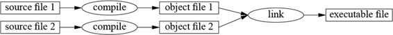
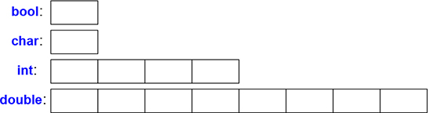
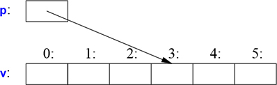
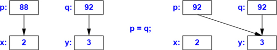
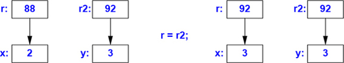

# 1 Հիմունքները

_Մեր առաջին գործը այն կլինի, որ սպանենք բոլոր օրենսգետներին։_

_Հենրի VI, Մաս II, Արարված չորրորդ, Տեսարան երկրորդ_

* Ներածություն
* Ծրագրեր
  * Hello, World!
* Ֆունկցիաներ
* Տիպեր, փոփոխականներ և թվաբանություն
  * Թվաբանություն; Ինիցիալիզացիա
* Տեսանելիության տիրույթ և կյանքի տևողություն
* Հաստատուններ
* Ցուցիչներ, զանգվածներ և հղումներ
  * Զրոյական ցուցիչ
* Պայմանների ստուգում
* Ապարատային ներկայացում
  * Վերագրում; Ինիցիալիզացիա
* Խորհուրդներ


## 1.1 Ներածություն

Այս գլուխը ոչ խիստ ձևով ներկայացնում է C++ լեզուն, C++-ի՝ հիշողության և հաշվարկման մոդելները, և ծրագրերում կոդի կազմակերպման հիմնական մեխանիզմները։ Սրանք լեզվի այն հնարավորություններն են, որոնք ավելի հաճախ հանդիպում են C լեզվում և այդ ոճը երբեմն անվանում են _պրոցեդուրային ծրագրավորում_։


## 1.2 Ծրագրեր

C++-ը թարգմանվող (կոմպիլյացվող) լեզու է։ Ծրագրին աշխատեցնելու համար նրա սկզբնական տեքստը (source text) պետք է մշակել կոմպիլյատորով և ստանալ օբյեկտային ֆայլեր, ապա վերջիններս էլ միավորել կապակցող ծրագրով (linker) և ստանալ կատարվող ծրագիրը։ Սովորաբար C++ լեզվով գրված ծրագիրը բաղկացած է ծրագրային տեքստի բազմաթիվ ֆայլերից (ավելի հաճախ պարզապես՝ _սկզբնական ֆայլեր_, _source files_)։ ??



Կատարվող ծրագիրը ստեղծվում է որոշակի ապարատ-համակարգ զույգի համար. այն տեղափոխելի չէ, ասենք, Mac-ից Windows-ի։ Երբ խոսում ենք C++ ծրագրերի տեղափոխելիության մասին, ապա սովորաբար նկատի ունենք ծրագրային տեքստերի տեղափոխելիությունը, այսինքն՝ սկզբնական տեքստերը կարող են հաջողությամբ թարգմանվել ու կատարվել տարատեսակ համակարգերում։

ISO C++ ստանդարտը սահմանում է երկու տեսակի էություններ.

* _Լեզվի հիմնական հնարավորություններ_, ինչպիսիք են ներդրված տիպերը (օրինակ՝ `char` և `int`) և ցիկլերը (օրինակ՝ `for` և `while` հրամանները)։
* _Ստանդարտ գրադարանի բաղադրիչներ_, ինչպիսիք են կոնտեյներները (օրինակ՝ `vector` և `map`) և ներմուծման/արտածման գործողությունները (օրինակ՝ `<<` և `getline()`)։

Ստանդարտ գրադարանի բաղադրիչները գերազանցապես C++ լեզվի ծրագրեր են, որոնցով համալրված է C++ լեզվի յուրաքանչյուր իրականացում։ Այսինքն՝ C++ լեզվի ստանդարտ գրադարանը կարող է իրականացվել և իրականացված է հենց C++ լեզվով (մեքենայական կոդի չնչին օգտագործմամբ, այնպիսի դեպքերում, ինչպիսին է հոսքի  կոնտեքստի փոփոխումը — thread context switching): Սրանից հետևում է, որ C++-ը բավականաչափ արտահայտիչ և արդյունավետ է ամենախստապահանջ համակարգային ծրագրավորման խնդիրների համար։

C++-ը տիպերի ստատիկ ստուգմամբ (statically typed) լեզու է։ Այսինքն, ծրագրում մասնակցող ամեն մի միավորի (օբյեկտ, արժեք կամ արտահայտություն) տիպը կոմպիլյատորին պետք է հայտնի լինի հենց իր օգտագործման կետում։ Օբյեկտի տիպով որոշվում է դրան կիրառելի գործողությունների բազմությունը։

### 1.2.1 Hello, World!

C++ լեզվով գրված պարզագույն ծրագիրը հետևյալն է.

```C++
int main() {}    // C++-ով գրված ամենակարճ ծրագիրը
```

Այստեղ սահմանված է `main` ֆունկցիան, որը ոչ մի արգումենտ չի ստանում և ոչ մի գործողություն չի կատարում։

C++-ում ձևավոր փակագծերը՝ `{}`, ցույց են տալիս խմբավորում։ Այստեղ նրանք ցույց են տալիս ֆունկցիայի մարմնի սկիզբն ու վերջը։ Երկու թեք գծերով՝ `//`, սկսվում է մեկնաբանություն, որը շարունակվում է մինչև տողի վերջը։ Մեկնաբանությունը գրվում է ընթերցողի համար, կոմպիլյատորն այն անտեսում է։

C++-ով գրված ցանկացած ծրագիր պետք է ունենա `main()` անունով ճիշտ մեկ գլոբալ ֆունկցիա։ Ծրագիրն սկսվում է այդ ֆունկցիայի կատարումով։ `main()` ֆունկցիայի վերադարձրած `int` արժեքը, եթե այդպիսին կա, ծրագրի վերադարձրած արժեքն է «համակարգին»։ Եթե ոչ մի արժեք չի վերադարձվում, համակարգը կստանա բարեհաջող ավարտ նշանակող որևէ արժեք։ `main()` ֆունկցիայից վերադարձվող զրոյից տարբեր արժեքը նշանակում է ծրագրի կատարման ձախողում։ Ոչ բոլոր օպերացիոն համակարգերն ու կատարման միջավայրերն են օգտագործում այդ վերադարձված արժեքը. Linux/Unix-ի վրա հիմնված միջավայրերը հաճախ օգտագործում են, իսկ Windows-ի վրա հիմնված համակարգերը՝ երբեմն։

Որպես կանոն ծրագիրն ինչ-որ բան է արտածում։ Ստորև բերված է ծրագիր, որն էկրանին տպում է `Hello, World!` տեքստը։

```C++
#include <iostream>
int main()
{
    std::cout << "Hello, World!\n";
}
```

`#include <iostream>` տողը կոմպիլյատորին հրահանգում է `iostream` ֆայլից ծրագրին _կցել_ ստանդարտ ներմուծման/արտածման միջոցների սահմանումները։ Առանց այդ սահմանումների

```C++
std::cout << "Hello, World!\n"
```

արտահայտությունը իմաստ չի ունենա։ `<<` (ուղարկել) օպերատորն իր երկրորդ արգումենտը գրում է առաջինի մեջ։ Այս դեպքում `"Hello World!\n"` տեքստային հաստատունը (լիտերալը) գրվում է `std::cout` արտածման ստանդարտ հոսքի մեջ։ Տողը նիշերի հաջորդականություն է՝ ներառված կրկնակի չակերտներում։ Տողի մեջ հակառակ թեք գիծը՝ `\` (backslash), իրենից հետո մեկ այլ նիշի հետ միասին նշանակում է «հատուկ սիմվոլ»։ Այս դեպքում `\n`֊ը նոր տողի սիմվոլն է. այսինքն՝ գրված են `Hello, World!` նիշերը և դրանց հաջորդող նոր տողի նիշը։

`std::` նախդիրը ցույց է տալիս, որ `cout` անունը գտնվում է ստանդարտ գրադարանի անունների տիրույթում ([§3.4](ch-03-modularity.md))։ Ստանդարտ գրադարանի հնարավորությունները քննարկելիս ես սովորաբար բաց եմ թողնում `std::`-ն։ [§3.4](ch-03-modularity.md)-ում ցույց է տրվում, թե ինչպես մի որևէ անունների տիրույթի անունները դարձնել տեսանելի՝ առանց նախդիրը բացահայտ նշելու։

Ընդհանրապես ամբողջ կատարվող կոդը բաշխվում է ֆունկցիաների մեջ և ուղղակիորեն կամ անուղղակիորեն կանչվում է `main()` ֆունկցիայից։ Օրինակ․

```C++
#include <iostream>  // կցել Ն/Ա գրադարանի սահմանումները

using namespace std; // `std` անունների տիրույթի անունները դարձնում է տեսանելի առանց `std::`֊ի (§3.4)

double square( double x ) // կրկնակի ճշտության իրական թվի քառակուսին
{
    return x * x;
}

void print_square( double x )
{
    cout << x << "-ի քառակուսին " << square(x) << "է \n";
}

int main()
{
    print_square( 1.234 );  // արտածում է. 1.234-ի քառակուսին 1.52276 է
}
```

`void` «վերադարձվող արժեքի տիպը» ցույց է տալիս, որ ֆունկցիան որևէ արժեք չի վերադարձնում։


## 1.3 Ֆունկցիաներ

C++ ծրագրով ինչ-որ գործ անելու միակ եղանակը համապատասխան ֆունկցիան կանչելն է։ Ֆունկցիայի սահմանումն է այն ճանապարհը, որով դուք նկարագրում եք կատարվելիք գործողությունը։ Եթե ֆունկցիան նախապես չի հայտարարվել, ապա այն հնարավոր չէ կանչել։

Ֆունկցիայի հայտարարությամբ տրվում են ֆունկցիայի անունը, վերադարձվող արժեքի տիպը (եթե այդպիսին կա) և կանչի ժամանակ տրվող արգումենտների քանակն ու տիպերը։ Օրինակ․

```C++
Elem* next_elem();   // արգումենտներ չկան, վերադարձնում է Elem֊ի ցուցիչ (Elem*)
void exit(int);      // ստանում է int տիպի արգումենտ, ոչինչ չի վերադարձնում
double sqrt(double);  // double արգումենտ, վերադարձնում է double
```

Ֆունկցիայի հայտարարության մեջ վերադարձվող արժեքի տիպը գրվում է ֆունկցիայի անունից առաջ, իսկ արգումենտների տիպերը՝ ֆունկցիայի անունից հետո՝ փակագծերի մեջ։

Արգումենտների փոխանցման սեմանտիկան նույնական է ինիցիալիզացիայի (initialization) սեմանտիկային (§3.6.1)։ Այսինքն, ստուգվում են արգումենտների տիպերը և անհրաժեշտության դեպքում կատարվում է տիպերի ոչ բացահայտ ձևափոխություն (§1.4)։ Օրինակ․

````C++
double s2 = sqrt(2);  // կանչել sqrt() ֆունկցիան double{2} արգումենտով
double s3 = sqrt("three");  // սխալ․ sqrt()֊ը պահանջում է double տիպի արգումենտ
````

Կոմպիլյացիայի ժամանակ կարարվող այսպիսի ստուգումների ու տիպերի ձևափոխության արժեքը պետք չէ թերագնահատել։

Ֆունկցիայի հայտարարությունը կարող է պարունակել նաև արգումենտների անունները։ Սա կարող է օգնել ծրագիրը կարդացողին, բայց, եթե հայտարարությունը միաժամանակ նաև ֆունկցիայի սահմանում չէ, ապա կոմպիլյատորը պարզապես անտեսում է այդ անունները։ Օրինակ․

````C++
double sqrt(double d);   // վերադարձնում է d֊ի քառակուսի արմատը
double square(double);   // վերադարձնում է արգումենտի քառակուսի արմատը
````

Ֆունկցիայի տիպը բաղկացած է վերադարձվող արժեքի տիպից և արգումենտների տիպերի հաջորդականությունից։ Օրինակ․

````C++
double get(const vector<double>& vec, int index);  // տիպը՝ double(const vector<double>&, int)
````

Ֆունկցիան կարող է լինել նաև դասի անդամ (member of a class) (§2.3, §4.2.1)։ Այդպիսի _անդամ-ֆունկցիայի_ համար իր դասի անունը նույնպես ֆունկցիայի տիպի մաս է։ Օրինակ.

```C++
char& String::operator[](int index);   // տիպը՝ char& String::(int)
```

Ցանկալի է, որ մեր ծրագիրը լինի դյուրըմբռնելի քանի որ դա կոդի սպասարկելիության (maintainability) առաջին նախապայմանն է։ Դյուրըմբռնելիությանը հասնելու առաջին քայլը հաշվարկային խնդիրը իմաստալից կտորների՝ որպես ֆունկցիաներ ու դասեր, բաժանելն է ու դրանց անուններ տալն է։ Այդպիսի ֆունկցիաներն այնուհետև կազմում են հաշվարկման հիմնական բառապաշարը, ճիշտ այնպես, ինչպես տիպերն են ապահովում (ներդրված և օգտագործողի սահմանված) տվյալների հիմնական բառապաշարը։ C++ լեզվի ստանդարտ ալգորիթմները (օր․ `find`, `sort` և `iota`) լավ սկիզբ են ([Գլուխ 12](ch-12-algorithms.md))։ Դրանք օգտագործելով կարող ենք կառուցել ֆունկցիաներ, որոնք ավելի մեծ հաշվարկի մեջ ներկայացնում են ընդհանուր կամ մասնավոր խնդիրները:

Կոդի մեջ սխալների թիվը խիստ փոխկապակցված է կոդի քանակի և բարդության հետ։ Այս երկու խնդիրներն էլ կարող են լուծվել ավելի շատ ու ավելի կարճ ֆունկցիաների օգտագործմամբ։ Ֆունկցիայի օգնությաբ ինչ-որ առանձին գործ անելը մեզ զերծ է պահում արդեն գոյություն ունեցող կոդի մեջ ինչ-որ հատուկ կոդ գրելուց։ Նոր կոդը ձևակերպելով որպես ֆունկցիա՝ ստիպված ենք լինում անուն տալ այդ գործողությանը և նկարագրել դրա կախվածությունները։

Եթե մի քանի ֆունկցիաներ սահմանված են նույն անունով, բայց տարբեր տիպի արգումենտներով, ապա կոմպիլյատորն ամեն մի կանչի դեպքում կընտրի առավել համապատասխան տարբերակը։ Օրինակ․

````C++
void print(int);     // ստանում է ամբողջ տիպի արգումենտ
void print(double);  // ստանում է սահող ստորակետով տիպի արգումենտ
void print(string);  // ստանում է տող արգումենտ

void user()
{
   print(42);                   // կանչվում է print(int)֊ը
   print(9.65);                 // կանչվում է print(double)֊ը
   print("D is for Digital");   // կանչվում է print(string)֊ը
}
````

Եթե ֆունկցիայի երկու տարբերակներն էլ կարող են կանչվել, բայց նրանցից ոչ մեկն ավելի նախընտրելի չէ քան մյուսը, ապա կանչը համարվում է ոչ միանշանակ, և կոմպիլյատորն ազդարարում է սխալի մասին։ Օրինակ․

````C++
void print(int, double);
void print(double, int);

void user2()
{
  print(0, 0);  // սխալ․ անորոշություն
}
````

Նույն անունով մի քանի ֆունկցիաների սահմանումը կոչվում է _ֆունկցիայի գերաբեռնում_ (function overloading). այն ընդհանրացված ծրագրավորման հիմնարար հասկացություններից է ([§7.2](ch-07-concepts-and-generic-programming.md))։ Երբ ֆունկցիան գերաբեռնված է, ապա նույն անունով բոլոր ֆունկցիաները պետք է ներկայացնեն միևնույն սեմանտիկան (իմաստը)։ Օրինակ՝ վերը բերված `print()` ֆունցիաները. դրանք բոլորն էլ տպում են իրենց արգումենտը։


## 1.4 Տիպեր, փոփոխականներ և թվաբանություն

Յուրաքանչյուր անուն և յուրաքանչյուր արտահայտություն ունի տիպ, որով որոշվում են նրան կիրառելի գործողությունները։ Օրինակ.

```C++
int inch;
```

հայտարարությունը նշում է, որ `inch`-ի տիպը `int` է, այսինքն `inch`-ը ամբողջաթիվ փոփոխական է։

_Հայտարարությունը_ մի հրաման է, որը ծրագրին է ներկայացնում նոր միավորը։ Այն նշում է նոր միավորի տիպը․

* _Տիպը_  (օբյեկտի համար) սահմանում է հնարավոր արժեքների և հնարավոր գործողությունների բազմությունը։
* _Օբյեկտը_ հիշողության մի տիրույթ է, որը պարունակում է որոշակի տիպի արժեք։
* _Արժեքը_ բիթերի բազմություն է, որը մեկնաբանվում է ըստ իր տիպի։
* _Փոփոխականը_ անվանված օբյեկտ է։

C++ լեզուն առաջարկում է հիմնարար տիպերի մի փոքր գազանանոց, բայց քանի որ ես կենդանաբան չեմ՝ դրանք բոլորը չեմ թվարկի։ Բոլոր տիպերի մասին կարող եք կարդալ տեղեկատուներում, օրինակ, [Stroustrup, 2003] կամ [cppreference](https://en.cppreference.com/)։ Ահա մի քանի օրինակներ․

````C++
bool       // տրամաբանական տիպ, հնարավոր արժեքներն են true և false
char       // նիշ, օրինակ 'a', 'z' կամ '9'
int        // ամբողջ թիվ, օրինակ -273, 42 կամ 1066
double     // կրկնակի ճշտությամբ սահող ստորակետով թիվ, օրինակ -273.15, 3.14 կամ 299793.0
unsigned   // ոչ բացասական ամբողջ թիվ, օրինակ 0, 1 կամ 999
````

Ամեն մի ֆունդամենտալ տիպ ուղղակիորեն արտապատկերվում է ապարատային միջոցներին և ունի կոնկրետ չափ, որով և սահմանվում է նրա արժեքների բազմությունը։



`char` տիպի փոփոխականի չափն այնպիսին է, որը տվյալ մեքենայում կարող է պահել մեկ նիշ (սովորաբար՝ 8 բիթանոց բայթ), մյուս տիպերի չափերը պատիկ են `char`֊ի չափին։ Տիպի չափը կախված է իրականացումից (այսինքն այն կարող է տարբեր մեքենաներում տարբեր լինել) և այն կարելի է ստանալ `sizeof` օպերատորի միջոցով, օրինակ, `sizeof(char)`֊ը հավասար է `1`֊ի, իսկ `sizeof(int)`֊ը հաճախ `4` է։

Թվերը կարող են լինել սահող կետով (floating-point) կամ ամբողջ (integer).

* Սահող կետով թվերը կարելի է տարբերել տասնորդական կետով (օր., `3.14`) կամ ցուցիչով (օր., `3e-2`)։
* Ամբողջաթիվ լիտերալները լռելությամբ ունեն տասական գրառում (օր., `42`-ը նշանակում է քառասուներկու)։ `0b` նախածանցով գրառվում են երկուական (2 հիմքով) ամբողջաթիվ լիտերալները (օր., `0b10101010`): `0x` նախածանցով գրառվում են տասնվեցական (16 հիմքով) ամբողջաթիվ լիտերալները (օր., `0xBAD1234`)։ `0` նախածանցով գրառվում են ութական (8 հիմքով) ամբողջաթիվ լիտերալները (օր., `0334`)։

Երկար լիտերալները մարդկանց համար ընթեռնելի դարձնելու համար կարող ենք օգտագործել ապաթարցը (`'`) որպես թվերի բաժանիչ։ Օրինակ, _π_-ն մոտավորապես հավասար է `3.14159'26535'89793'23846'26433'83279'50288`, կամ, եթե նախընտրում եք տասնվեցական գրառումը, ապա՝ `0x3.243F'6A88'85A3'08D3`։


### 1.4.1 Թվաբանություն

Թվաբանական գործողությունները կարող են օգտագործվել hիմնական տիպերի համապատասխան կոմբինացիաներում․ ??

````C++
x+y    // գումարում
+x     // ունար գումարում
x-y    // հանում
-x     // ունար հանում
x*y    // բազմապատկում
x/t    // բաժանում
x%y    // ամբողջ թվերի բաժանման մնացորդ (մոդուլուս)
````

Նույն ձևով կարող են օգտագործվել նաև համեմատման գործողությունները․

````C++
x==y  // հավասար է
x!=y  // հավասար չէ
x<y   // փոքր է
x>y   // մեծ է
x<=y  // փոքր է կամ հավասար
x>=y  // մեծ է կամ հավասար
````

Ավելին, առկա են նաև տրամաբանական գործողություններ․

````C++
x&y   // բիթային և
x|y   // բիթային կամ
x^y   // բիթային բացառող կամ
~x    // բիթային լրացում
x&&y  // տրամաբանական և
x||y  // տրամաբանական կամ
!x    // տրամաբանական ոչ (ժխտում)
````

Բիթային տրամաբանական գործողության արդյունքն իր այն օպերանդի տիպի է, որի բիթերի համար կատարվել է գործղությունը։ Տրամաբանական `&&` և `||` գործողությունները պարզապես վերադարձնում են `true` կամ `false`՝ կախված իրենց օպերանդների արժեքներից։

Վերագրման և թվաբանական գործողություններում C++ լեզուն կատարում է հիմնական տիպերի միջև բոլոր իմաստալից ձևափոխումներն այնպես, որ դրանք կարելի է համատեղ օգտագործել․ ??

````C++
void some_function()   // ֆունկցիան ոչի մի արժեք չի վերադարձնում
{
    double d = 2.2;  // սահող կետով թվի սկզբնարժեքավորում
    int i = 7;       // ամբողջ թվի սկզբնարժեքավորում
    d = d + i;       // d֊ին վերագրել գումարը
    i = d * i;       // i֊ին վերագրել արտադրյալը (զգուշացեք, d*i իրական արժեքը կրճատվում է int-ի)
}
````

Արտահայտությունների մեջ օգտագործված ձևափոխությունները կոչվում են _սովորական թվաբանական ձևափոխություններ_ և երաշխավորում են, որ արտահայտությունները հաշվարկվում են իրենց օպերանդների ամենաբարձր ճշտությամբ։ Օրինակ, `double` և `int` թվերի գումարումը կատարվում է կրկնակի ճշտությամբ սահող ստորակետով թվերի թվաբանության կանոններով։

Նշենք, որ `=`֊ը վերագրման գործողությունն է, իսկ `==`֊ը՝ հավասարության։

Բացի սովորական թվաբանական և տրամաբանական օպերատորներից C++ լեզուն առաջարկում է փոփոխականի արժեքը փոխելու ևս մի քանի գործողություններ.

````C++
x+=y   // x = x+y
++x    // ինկրեմենտ՝ x = x+1
x-=y   // x = x-y
--x    // դեկրեմենտ՝ x = x-1
x*=y   // x=x*y
x/=y   // x=x/y
x%=y   // x=x%y
````

Այս օպերատորները հակիրճ են, հարմար և շատ հաճախ են օգտագործվում։

Արտահայտությունների հաշվարկման կարգը ձախից-աջ է, բացառությամբ վերագրման, որում հաշվարկումը աջից-ձախ է։ Ֆունկցիայի արգումենտների հաշվարկման կարգը ցավոք սահմանված չէ։


### 1.4.2 Ինիցիալիզացիա

Օգտագործվելուց առաջ օբյեկտը պետք է արժեք ստանա։ C++-ն առաջարկում է ինիցիալիզացիայի արտահայտման մի քանի գրառում. ինչպես վերն օգտագործված `=` նշանը, և ունիվերսալ եղանակը՝ ձևավոր փակագծերի մեջ առնված արժեքների ցուցակով։

````C++
double d1 = 2.3;             // d1֊ին տրվում է 2.3 սկզբնական արժեքը
double d2 {2.3};             // d2-ին տրվում է 2.3 սկզբնական արժեքը
comples<double> z = 1;       // կոմպլեքս թիվ` կրկնակի ճշտությամբ սահող կետով թվի սկալյարներով
complex<double> z2 {d1,d2};
complex<double> z3 = {1,2};  // =֊ը {}֊ի հետ պարտադիր չէ
vector<int> v{1,2,3,4,5,6};  // int֊երի վեկտոր
````

`=`-ով ձևն ավանդական է և ժառանգություն է մնացել Սի լեզվից, բայց եթե կասկածում եք՝ որն ընտրել, ապա ընտրեք ձևավոր փակագծերը՝ `{}`։ Նվազագույնը՝ այն կփրկի ձեզ ինֆորմացիան կորցնող ձևափոխություններից։ Օրինակ.

````C++
int i1 = 7.2;    // i1-ը ստանում է 7 արժեքը (զարմանալի՞ է)
int i2 {7.2};	     // սխալ՝ սահող կետով թվի ձևափոխություն ամբողջ թվի
````

Դժբախտաբար, ինֆորմացիան կորցնող ձևափոխությունները՝ արժեքների տիրույթը _նեղացող ձևափոխումները_, ինչպիսիք են, օրինակ, `double`֊ից `int`, `int`֊ից `char`, թույլատրելի են և անբացահայտ կատարվում են։ Դա այն գինն է, որ վճարվում է C լեզվի հետ համատեղելիության համար (§16.3)։

Հաստատունը (§1.6) հնարավոր չէ թողնել առանց սկզբնական արժեքի, իսկ փոփոխականն առանց սկզբնական արժեքի կարելի է թողնել միայն բացառիկ դեպքերում։ Մի ներմուծեք նոր անուն, քանի դեռ դրա համար համապատասխան արժեք չունեք։ Օգտագործողի կողմից սահմանված տիպերը (ինչպիսիք են՝ `string`, `vector`, `Matrix`, `Motor_controller` կամ `Orc_warrior`) կարող են սահմանվել անուղղակի ինիցիալիզացիայով (§4.2.1)։

Որևէ փոփոխական հայտարարելիս կարիք չկա բացահայտ նշել նրա տիպը՝ եթե վերջինս հնարավոր է դուրս բերել սկզբնական արժեքից։

````C++
auto b = true;     // bool
auto ch = 'x';     // char
auto i = 123;      // int
auto d = 1.2;      // double
auto z = sqrt(y);  // z-ի տիպը sqrt(y)-ի վերադարձրած արժեքի տիպն է
````

`auto` բառի հետ հակված ենք օգտագործել `=`-ով գրառումը, քանի որ այդտեղ տիպի ձևափոխության վտանգ չկա, բայց եթե նախընտրում եք ամենուրեք օգտագործել `{}`, ապա կարող եք վարվել այդպես:

`auto` բառն օգտագործում ենք այն դեպքերում, երբ տիպը բացահայտ նշելու որևէ հատուկ պատճառ չկա։ «Հատուկ պատճառ» կարող է համարվել.

* Սահմանումն այնպիսի մեծ տեսանելիության տիրույթում է, որ անպայման ուզում ենք տիպը հստակ տեսանելի լինի կոդը կարդացողին։
* Ցանկանում ենք հստակ նշել փոփոխականի արժեքների տիրույթը կամ ճշտությունը (օր․, `double`, թե՞ `float`)։

Օգտագործելով `auto` բառը, շատ անգամ խուսափում ենք ավելորդություններից և տիպերի երկար անուններ գրելուց։ Սա հատկապես կարևոր է ընդհանրացված ծրագրավորման մեջ, որտեղ ծրագրավորողը կարող է չիմանալ օբյեկտի հստակ տիպը, իսկ տիպերի անունները կարող են շատ երկար լինել (§12.2)։


## 1.5 Տեսանելիության տիրույթ և կյանքի տևողություն

Հայտարարութունը տեսանելիության տիրույթ (scope) է ներմուծում նոր անուն․ ??

* _Լոկալ տիրույթ_։ Ֆունկցիայի (§1.3) կամ լամբդա արտահայտության (§6.3.2) մեջ հայտարարված անունը կոչվում է _լոկալ անուն_։ Նրա տեսանելիության տիրույթը տարածվում է նրա հայտարարության կետից մինչև այն բլոկի վերջը, որտեղ գործում է այդ հայտարարությունը։ _Բլոկը_ սահմանափակված է մեկ զույգ `{}` ձևավոր փակագծերի միջև։ Ֆունկցիայի արգումենտների անունները համարվում են լոկալ անուններ։
* _Դասի տիրույթ_։ Անունը կոչվում է _անդամ անուն_ (կամ _դասի անդամ անուն_), եթե այն սահմանվել է դասի ներսում (§2.2, §2.3, Գլուխ 4)՝ որևէ ֆունկցիայի (§1.3), լամբդա արտահայտության (§6.3.2) կամ `enum class`-ի (§2.5) սահմաններից դուրս։ Նրա տեսանելիության տիրույթը տարածվում է իր հայտարարությունն ընդգրկող բլոկի `{` բացող փակագծից մինչև այդ հայտարարության վերջը։
* _namespace-ի տիրույթ_։ Անունը կոչվում է _անունների տիրույթի անդամ անուն_, եթե այն սահմանվել է այդ անունների տիրույթում (§3.4)՝ դուրս ցանկացած ֆունկցիայի, լամբդա արտահայտության (§6.3.2), դասի (§2.2, §2.3, գլուխ 4) կամ `enum class`֊ի (§2.5) սահմաններից դուրս։ Նրա տեսանելիության տիրույթը տարածվում է իր հայտարարության կետից մինչև իր անունների տիրույթի վերջը։

Այն անունը, որը չի հայտարարվել որևէ կառուցվածքի ներսում, կոչվում է _գլոբալ անուն_, և ասում են, որ այն գտնվում է _անունների գլոբալ տիրույթում_։

Ի հավելումն ասվածի՝ կարող ենք ունենալ առանց անունների օբյեկտներ, ինչպիսիք են, օրինակ, ժամանակավոր և `new` օպերատորով (§4.2.2) ստեղծված օբյեկտները: Օրինակ․

````C++
vector<int> vec;  // vec-ը գլոբալ է (ամբողջ թվերի գլոբալ վեկտոր)

struct Record {
    string name; // name-ը Record-ի անդամ է (string տիպով)
    //...
};

void fct(int arg) // fct-ն գլոբալ է (գլոբալ ֆունկցիա)
                  // arg֊ը լոկալ է (ամբողջ տիպի արգումենտ)
{
    string motto{"Who dares win"}; // motto֊ն լոկալ է
    auto p = new Record{"Hume"};   // p֊ն ցուցիչ է (new-ով ստեղծված) անանուն Record֊ի
    // ...
}
````

Օբյեկտը պետք է կառուցվի (սկզբնական արժեք ստանա) մինչև օգտագործվելը և պետք է ոչնչացվի իր տեսանելիության տիրույթի վերջում։ Անունների տիրույթի (namespace) օբյեկտի համար ոչնչացման կետը ծրագրի ավարտն է։ Անդամ անունների համար ոչնչացման կետը որոշվում է այն օբյեկտի ոչնչացման կետով, որի անդամն է համարվում տվյալ անունը։ `new` գործողությամբ միջոցով ստեղծված օբյեկտներն «ապրում են» մինչև `delete` (§4.2.2) գործողությամբ ոչնչացվելը։ ??


## 1.6 Հաստատուններ

C++ լեզվում նախատեսված է օբյեկտի անփոփոխելիության (immutability) երկու գրառում.

* `const` — որը, պատկերավոր ասած, նշանակում է․ «Ես խոստանում եմ չփոփոխել այս արժեքը»։ Սա հիմնականում օգտագործվում է ինտերֆեյսները սահմանելիս, ցույց տալու համար, որ տվյալները ցուցիչների կամ հղումների միջոցով ֆունկցիաներին փոխանցելիս կարող ենք համոզված լինել, որ դրանք չեն փոփոխվելու։ Կոմպիլյատորը նախապատվություն է տալիս `const`-ով նշված խոստմանը։ `const`-ի արժեքը կարող է հաշվարկվել կատարման ժամանակ։
* `constexpr` — նշանակում է. «պետք է հաշվարկվի կոմպիլյացաիայի ժամանակ»։ Սա օգտագործվում է հաստատունները սահմանելու, դրանք միայն կարդալու համար նախատեսված հիշողության մեջ գրանցելու համար (որտեղ քիչ հավանական է դրա վնասվելը), և արտադրողականության մեծացման համար։ `constexpr`-ով հայտարարված արժեքը պետք է հաշվարկվի կոմպիլյատորի կողմից։

Օրինակ․

````C++
constexpr int dmv = 17; // dmv-ն անվանված հաստատուն է
int var = 17;           // var-ը հաստատուն չէ
const double sqv = sqrt(var); // sqv-ը անվանված հաստատուն է, միգուցե հաշվարկված կոմպիլյացիայի ժամանակ
double sum(const vector<double>&); // sum-ը չի փոխի իր արգումենտը (§1.7)
vector<double> v{1.2, 3.4, 4.5}; // v-ն հաստատուն չէ
const double s1 = sum(v); // OK, sum(v)-ն հաշվարկվում է կատարման ժամանակ
constexpr double s2 = sum(v); // սխալ, sum(v)-ն հաստատուն արտահայտություն չէ
````

Որպեսզի ֆունկցիան հնարավոր լինի օգտագործել _հաստատուն արտահայտության_ մեջ, այսինքն՝ կոմպիլյացիայի ժամանակ հաշվարկվող արտահայտության մեջ, այն պետք է սահմանվի որպես `constexpr`։ Օրինակ.

```C++
constexpr double square(double x) { return x*x; }

constexpr double max1 = 1.4*square(17);       // OK, 1.4*square(17)-ը հաստատուն արտահայտություն է
constexpr double max2 = 1.4*square(var);      // սխալ, var-ը հաստատուն արտահայտություն չէ
const double max3 = 1.4*square(var);          // OK, կարող է հաշվարկվել կատարման ժամանակ
```

`constexpr` ֆունկցիան կարող է կիրառվել ոչ-հաստատուն արգումենտներով, սակայն այդ դեպքում արդեն արդյունքը հաստատուն արտահայտություն չէ։ Մենք թույլատրում ենք `constexpr` ֆունկցիան կանչել ոչ-հաստատուն-արտահայտություն արգումենտներով այնպիսի համատեքստում, որը չի պահանջում հաստատուն արտահայտություն։ Այդ կերպ ստիպված չենք լինում նույն ֆունկցիան սահմանել երկու անգամ. մեկը՝ հաստատուն արտահայտությունների, մյուսը՝ փոփոխականների համար։

`constexpr` լինելու համար ֆունկցիան պետք է լինի բավականաչափ հասարակ, չի կարող ունենալ կողմնակի էֆեկտ և կարող է օգտագործել միայն իր արգումենտներով ստացած ինֆորմացիան։ Մասնավորապես, այն չի կարող փոփոխել ոչ-լոկալ փոփոխականները, բայց կարող է ունենալ ցիկլեր և կարող է օգտագործել իր սեփական փոփոխականները։ Օրինակ.

```C++
constexpr double nth(double x, int n)   // ենթադրվում է, որ 0 <= n
{
    double res = 1;
    int i = 0;
    while (i<n) {   // while-ցիկլ: կատարել, քանի դեռ պայմանը true է (§1.7.1)
         res*=x;
         ++i;
    }
    return res;
}
```

Որոշ տեղերում լեզվի կանոններն են պահանջում հաստատուն արտահայտություններ (օր., զանգվածի սահմանները (§1.7), `case`-ի պիտակները (§1.8), կաղապարների (template) արժեք արգումենտները (§6.2) և `constexpr`-ով հայտարարված հաստատունները)։ Որոշ այլ դեպքերում կոմպիլյացիայի ժամանակ կատարվող հաշվարկը կարևոր է արտադրողականության համար։ Բյաց, անկախ արտադրողականության հարցերից, անփոփոխելիության գաղափարը (օբյեկտ՝ չփոփոխվող վիճակով) նախագծման կարևոր խնդիր է։


## 1.7 Ցուցիչներ, զանգվածներ և հղումներ

Տվյալների ամենահիմնարար հավաքածուն իրար հարևանությամբ բաշխված նույնատիպ տարրերի հաջորդականությունն է. այն կոչվում է _զանգված_ (array)։ Սա ապարատուրայի կողմից առաջարկվող նվազագույնն է։ `char` տիպի տարրերի զանգվածը կարող է հայտարարվել հետևյալ կերպ․

````C++
char v[6];      // 6 նիշերի զանգված
````

Նմանապես ցուցիչը կարող է հայտարարվել հետևյալ կերպ․

````C++
char* p; // որևէ նիշի ցուցիչ
````

Հայտարարություններում `[]` փակագծերը նշանակում են «զանգված», իսկ `*`-ը՝ ցուցիչ։ Բոլոր զանգվածներում ստորին սահմանը `0`֊ն է, այսինքն՝ `v`֊ն ունի վեց տարր՝ `v[0]`֊ից `v[5]`։ Զանգվածի  չափը պետք է լինի հաստատուն արտահայտություն ([§1.6](#Հաստատուններ))։ Ցուցիչ փոփոխականը կարող է պահել համապատասխան տիպի օբյեկտի հասցեն․

````C++
char* p = &v[3];      // p-ն ցույց է տալիս v֊ի չորրորդ էլեմենտին
char x = *p;          // *p-ն այն օբյեկտն է, որին ցույց է տալիս p-ն
````

Արտահայտության մեջ նախածանցային ունար `*`֊ը նշանակում է «պարունակություն» (արժեք), իսկ նախածանցային ունար `&`֊ը՝ «հասցե»։ Կարող ենք այդ արժեքավորված սահմանման արդյունքը ներկայացնել գրաֆիկորեն․



Դիտարկենք տաս տարրերի պատճենումը մի զանգվածից մյուսի մեջ․

````C++
void copy_fct()
{
    int v1[10] = {0,1,2,3,4,5,6,7,8,9};
    int v2[10];       // դառնալու է v1-ի պատճենը

    for (auto i = 0; i != 10; ++i)   // պատճենել տարրերը
        v2[i] = v1[i];
        //...
}
````

Այս `for` հրամանը կարող է կարդացվել այսպես․ «`i`֊ին վերագրել զրո, քանի դեռ `i`֊ն `10` չէ, պատճենել `i`֊րդ տարրը և ավելացնել `i`֊ն մեկով»։ Ամբողջ տիպի կամ սահող կետով փոփոխականի նկատմամբ ավելացման օպերատորը՝ `++`, կիրառելիս  փոփոխականի արժեքն ավելանում է մեկով։ C++ լեզուն առաջարկում է նաև ավելի պարզ `for` հրաման՝ միջակայքի-`for` (range-`for`), հաջորդականության տարրերով պարզագույն իտերացիաների համար։

````C++
void print()
{
    int v[] = {0, 1, 2, 3, 4, 5, 6, 7, 8, 9};

    for(auto x : v) // յուրաքանչյուր x֊ի համար v֊ից
        cout << x << '\n';

    for(auto x: {10, 21, 32, 43, 54, 65})
        cout << x << '\n';
    //....
}
````

Առաջին range-`for`-ը կարող է կարդացվել այսպես․ «`v`֊ի ամեն մի տարրի համար, առաջինից՝ վերջինը, պատճենել արժեքն `x`-ի մեջ և տպել այն»։ Նկատենք, որ մենք պարտավոր չենք նշել զանգվածի սահմանները, երբ նրան սկզբնական արժեք ենք տալիս ցուցակով։ Range-`for` հրամանը կարող է օգտագործվել էլեմենտների ցանկացած հաջորդականության համար (§12.1):

Եթե ուզենայինք՝ արժեքները `v`֊ից `x`-ի մեջ պատճենելու փոխարեն, պարզապես `x`֊ը դարձնել `v`-ի տարրի հղում, կարող էինք գրել․

````C++
void increment()
{
    int v[] = {0,1,2,3,4,5,6,7,8,9};

    for (auto& x : v)
        ++x;
    // ...
}
````

Հայտարարության մեջ `&` ունար վերջածանցը նշանակում է «հղում»։ Հղումը նման է ցուցիչին, այն տարբերությամբ, որ կարիք չկա հղվող օբյեկտի արժեքը ստանալու համար օգտագործել `*` նախածանցը։ Բացի այդ՝ արժեքավորումից հետո հղումը չի կարելի փոխել այլ օբյեկտի վրա։

Հղումները հատկապես օգտակար են ֆունկցիայի արգումենտներ նշելիս։ Օրինակ․

````C++
void sort(vector<double>& v); // կարգավորել v֊ն
````

Հղում օգտագործելով վստահ ենք, որ `sort(my_vec)` կանչի համար `my_vec`-ը չի պատճենվում և կարգավորվում է ոչ թե `my_vec`֊ի պատճենը, այլ հենց սկզբնական օբյեկտը։

Երբ չենք ցանկանում փոփոխել ֆունկցիայի արգումենտը, բայց նաև չենք ուզում այն պատճենել, ապա օգտագործում ենք `const` հղում (§1.6)։ Օրինակ․

````C++
double sum(const vector<double>&)
````

Շատ տարածված են `const` հղում ստացող ֆունկցիաները։

Հայտարարությունների մեջ օգտագործվելիս օպերատորները (ինչպիսիք են `&`, `*` և `[]`) կոչվում են _հայտարարման օպերատորներ_։

````C++
T a[n];   // T[n], n հատ T֊երի զանգված
T* p;     // T*, T֊ի ցուցիչ
T& r;     // T&, T֊ի հղում
T f(A);   // T(A), ֆունկցիա, որը ստանում է A տիպի արգումենտ և վերադարձնում է T տիպի արդյունք
````

### 1.7.1 Զրոյական ցուցիչ

Որպեսզի ապահասցեավորման գործողությունն իմաստ ունենա, մենք ձգտում ենք, որ ցուցիչը միշտ ցույց տա որևէ օբյեկտի։ Երբ բացակայում է այն օբյեկտը, որին պետք է կապվի ցուցիչը, կամ եթե պետք է ներկայացնել «օբյեկտը հասանելի չէ» իրավիճակը, ցուցիչին տալիս ենք `nullptr` («զրոյական ցուցիչ») արժեքը։ Ցուցիչների բոլոր տիպերի համար գոյություն ունի միայն մեկ համատեղ օգտագործելի `nullptr` արժեք.

````C++
double* pd = nullptr;
Link<Record>* lst = nullptr;  // Record֊ի Link֊ի ցուցիչ
int x = nullptr;              // սխալ․ nullptr֊ը ցուցիչ է, ոչ թե ամբողջ թիվ
````

Հաճախ խելամիտ է ստուգել, որ ցուցիչ արգումենտն իսկապես ինչ-որ օբյեկտի է ցույց տալիս.

````C++
int count_x(char* p, char x)
  // հաշվում է x-ի՝ p[]-ի մեջ հանդիպելու քանակը
  // ենթադրվում է, որ p֊ն ցույց է տալիս զրոյով
  // վերջացող սիմվոլների զանգվածի (կամ ոչնչի)
{
    if (p == nullptr)
        return 0;
    int count = 0;
    for (; *p != 0; ++p)
        if (*p == x)
            ++count;
    return count
}
````

Ուշադրություն դարձնենք, թե ինչպես կարելի է ցուցիչը `++` գործողությամբ տեղափոխել զանգվածի հաջորդ տարրին, և թե ինչպես կարելի է `for` հրամանում բաց թողնել արժեքավորման հրամանը, եթե դրա կարիքը չկա։

`count_x()`֊ի սահմանումը ենթադրում է, որ `char*`֊ը _C֊ոճի տող_ է (C-style string), այսինքն՝ ցուցիչը ցույց է տալիս `char`֊երի՝ զրոյով վերջացող զանգվածի վրա։

Ավելի հին կոդերում `nullptr`֊ի փոխարեն սովորաբար օգտագործված է `0` կամ `NULL`։ Սակայն `nullptr`֊ի օգտագործումը բացառում է ամբողջ թվերի (ինչպիսիք են `0`֊ն կամ `NULL`֊ը) և ցուցիչների (ինչպիսին է `nullptr`֊ը) միջև հնարավոր շփոթությունը։

`count_if()` օրինակում `for` հրամանի ինիցիալիզացիայի բլոկը դատարկ է թողնված, այսինքն՝ կարող ենք օգտագործել ավելի պարզ `while` հրամանը։

```C++
int count_x(const char* p, char x)
    // հաշվում է x-ի՝ p[]-ի մեջ հանդիպելու քանակը
    // ենթադրվում է, որ p֊ն ցույց է տալիս զրոյով
    // վերջացող սիմվոլների զանգվածի (կամ ոչ մի բանի վրա)
{
    if (p==nullptr)
        return 0;
    int count = 0;
    while (*p) {
        if (*p==x)
            ++count;
        ++p;
    }
    return count;
}
```

`while` հրամանը կատարվում է մինչև պայմանի `false` դառնալը։

Թվային արժեքը որպես պայման օգտագործելը (`while (*p)`-ն `count_x()`-ում) համարժեք է այդ արժեքը զրոյի հետ համեմատելուն (`while (*p!=0)`)։ Պայմանում ցուցիչի արժեքն օգտագործելը (`if (p)`) համարժեք է այդ արժեքը `nullptr`-ի հետ համեմատելուն (`if (p!=nullptr)`)։

Գոյություն չունի «զրոյական հղում»։ Հղումը պետք է կապված լինի վավեր օբյեկտի հետ (և իրականացումները երաշխավորում են դա)։ Կան այս կանոնը խախտելու մութ ու խորամանկ ճանապարհներ. մի՛ արեք դա։


## 1.8 Պայմանների ստուգում

C++ լեզվում առկա են ճյուղավորման ու կրկնությունների կազմակերպման սովորական դարձած կառուցվածքները, ինչպիսիք են `if` և `switch` հրամանները, `while` և `for` ցիկլերը։ Օրինակ, ստորև սահմանված է ֆունկցիա, որն օգտագործողին ինչ-որ հարց է տալիս և վերադարձնում է պատասխանին համապատասխան տրամաբանական արժեքը։

````C++
bool accept()
{
    cout << "Do you want to proceed (y or n)?\n"; // արտածել հարցը
    char answer = 0;   // տալ արժեք, որը չի հանդիպելու պատասխանի մեջ
    cin >> answer;     // կարդալ պատասխանը

    if (answer == 'y')
        return true;
    return false;
}
````

Ի համապատասխանություն `<<` (ուղարկել) օպերատորի՝ օգտագործվում է `>>` (ստանալ) ներմուծման օպերատորը. `cin`֊ը ներմուծման ստանդարտ հոսքն է ([Գլուխ 10](ch-10-input-and-output.md))։ `>>` օպերատորի աջակողմյան օպերանդը որոշում է, թե ինչպիսի ներմուծում է սպասվում, և նույն այդ աջակողմյան օպերանդը հենց ներմուծման գործողության նպատակակետն է։ Արտածվող տողի վերջին `\n` նիշը նոր տողին անցման նիշն է (§1.2.1)։

Նկատենք, որ `answer`-ի սահմանումը գրված է այնտեղ, որտեղ դրա կարիքը կա (և ոչ թե ավելի վերև)։ Հայտարարությունը կարելի է գրել բոլոր այն տեղերում, որտեղ կարելի է գրել որևէ հրաման։

Օրինակը կարելի է ավելի լավացնել՝ որպես պատասխան նաև `n`-ը («ոչ»-ի համար) դիտարկելով․

````C++
bool accept2()
{
    cout << "Do you want to proceed (y or n)?\n";    // արտածել հարցը
    char answer = 0;  // տալ արժեք, որը չի հանդիպելու պատասխանի մեջ
    cin >> answer;    // կարդալ պատասխանը

    switch (answer) {
    case 'y':
        return true;
    case 'n':
        return false;
    default:
        cout << "I'll take that for a no.\n";
        return false;
    }
}
````

`switch` հրամանն իր արգումենտում տրված արժեքը համեմատում է հաստատունների բազմության տարրերի հետ։ Այդ հաստատունները, որոնք կոչվում են `case`-պիտակներ (`case`-label), պետք է լինեն իրարից տարբեր, և եթե ստուգվող արժեքը չի համընկնում դրանցից և ոչ մեկի հետ, ընտրվում է `default` պիտակը։ Եթե ստուգվող արժեքը ոչ մի `case`-պիտակի չի համընկնում, և `default` պիտակն էլ բացակայում է, ապա ոչ մի գործողություն չի կատարվում։

`case`-ից դուրս գալու համար կարիք չկա ավարտել `switch`֊հրամանը պարունակող ֆունկցիան։ Հաճախ պարզապես ցանկանում ենք ծրագրի կատարումը շարունակել `switch`-ին հաջորդող հրամանից։ Դա կարող ենք անել `break` հրամանով։ Որպես օրինակ դիտարկենք տեսախաղի մի պարզ հրամանի չափազանց խճճված, բայց պրիմիտիվ վերլուծիչ․

````c++
void action()
{
    while (true) {
        cout << "enter action:\n";    // ներմուծել գործողությունը
        string act;
        cin >> act;            // նիշերը կարդալ տողի մեջ
        Point delta{0,0};      // Point-ը {x, y} զույգ է

        for (char ch : act) {
            switch (ch){
            case 'u':    // վեր
            case 'n':    // հյուսիս
                ++delta.y;
                break;
            case 'r':    // աջ
            case 'e':    // արևելք
                ++delta.x;
            break;
            // ... այլ գործողություններ
            default:
                cout << "I freeaze!\n";
        }
        move(current+delta*scale);
        update_display();
      }
    }

}
````

Ինչպես `for` հրամանը (§1.7), `if` հրամանն էլ կարող է փոփոխական սահմանել և այն օգտագործել պայմանի մեջ։ Օրինակ.

```C++
void do_something(vector<int>& v)
{
     if (auto n = v.size(); n!=0) {
          // ... այստեղ ենք, երբ n != 0 ...
     }
     // ...
}
```

Այստեղ `n` ամբողջաթիվ փոփոխականը սահմանված է `if` հրամանում օգտագործելու համար, այն սկզբնական արժեք ստանում է `v.size()` արտահայտությամբ, և անմիջապես օգտագործվում է կետ-ստորակետից հետո գրված `n != 0` պայմանում։ Պայմանի մասում հայտարարված անունը տեսանելի է `if` հրամանի երկու ճյուղերում էլ։

Ինչպես և `for` հրամանի դեպքում, `if` հրամանի պայմանի մեջ փոփոխականի սահմանումը նպատակ ունի սահմանափակել վերջինիս տեսանելիության տիրույթը՝ լավացնելով կոդի ընթեռնելիությունն ու նվազեզնելով սխալների քանակը։

Առավել տարածված է փոփոխականի համեմատումը `0`-ի (կամ `nullptr`-ի) հետ։ Այդ դեպքերում պարզապես բաց թողեք պայմանի բացահայտ գրառումը։ Օրինակ.

```C++
void do_something(vector<int>& v)
{
     if (auto n = v.size()) {
          // ... այստեղ ենք, երբ n != 0 ...
     }
     // ...
}
```

Հնարավորության դեպքում նախապատվություն տվեք այս համառոտ ու պարզ գրառմանը։


## 1.9 Ապարատային ներկայացում

C++ լեզուն հնարավորություն է տալիս տվյալներն ու գործողություններն ուղղակի արտապատկերել ապարատային միջոցներին։ Երբ օգտագործում եք հիմնական ներդրված գործողություններից որևէ մեկը, ապա դրա իրականացումը ապարատային է, սովորաբար մեկ մեքենայական հրահանգ։ Օրինակ, երկու `int`-երի գումարման համար կատարվում է ամբողջ թվերի գումարման մեքենայական հրամանը։

C++-ի իրականացումը մեքենայական հիշողությունը դիտարկում է որպես հիշող տարրերի հաջորդականություն, որի մեջ կարող է տեղավորել (տիպիզացված) օբյեկտներ և դրանց հասցեավորել ցուցիչների գործածմամբ։


Ցուցիչը (pointer) հիշողության մեջ ներկայացվում է որպես մեքենայական հասցե, այսինքն այս նկարում `p`-ի թվային արժեքը կլինի `3`։ Եթե սա շատ նման է զանգվածի (§1.7), ապա այն պատճառով, որ C++-ում զանգվածը «հիշողության մեջ օբյեկտների անընդահատ հաջորդականության» հիմնական աբստրակցիան է։

Լեզվի հիմնական կառուցվածքներին ապարատային միջոցներին ուղղակի համապատասխանեցումը կարևոր է ցածր մակարդակի արտադրողականության համար, դրանով են տասնամյակներով հայտնի եղել C-ն և C++-ը։ C-ի և C++-ի հիմնական մեքենայական մոդելը հիմնված է կոմպյուտերի ապարատուրային, այլ ոչ թե մաթեմատիկական ինչ-որ ներկայացման։ ??

### 1.9.1 Վերագրում

Ներդրված տիպերի վերագրումը մեքենայական պարզ պատճենման գործողությունն է։ Դիցուք.

```C++
int x = 2;
int y = 3;
x = y;          // x-ը դառնում է 3
// նկատենք, որ x==y
```

Սա ակնհայտ է։ Կարող ենք գրաֆիկորեն ներկայացնել հետևյալ կերպ.


Նկատենք, որ երկու օբյեկտներն անկախ են։ Կարող ենք փոխել `y`-ի արժեքը առանց `x`-ի արժեքի վրա հետևանք թողնելու։ Օրինակ, `x = 99` վերագրումը չի փոխի `y`-ի արժեքը։ Ի տարբերություն Java, C#  և այլ լեզուների, բայց ի նմանություն C լեզվի, այս ասվածը ճիշտ է ոչ միայն `int`-ի, այլև բոլոր տիպերի համար։

Եթե ուզում ենք, որ տարբեր օբյեկտներ հղվեն նույն (ընդհանուր) արժեքի, ապա դա պետք է բացահայտ նշել։ Կարող ենք օգտագործել ցուցիչներ.

```C++
int x = 2;
int y = 3;
int* p = &x;
int* q = &y;    // հիմա p != q և *p != *q
p = q;          // p-ն դառնում է &y; հիմա p == q, այսինքն (ակնհայտորեն) *p == *q
```

Ասվածը կարող ենք գրաֆիկորեն պատկերել հետևյալ կերպ.



Ես պատահականորեն ընտրել եմ `88`-ը և `92`-ը որպես `int`-երի հասցեներ։ Նորից կարող ենք տեսնել, որ վերագրման ձախ կողմի օբյեկտը արժեք է ստանում աջ կողմի օբյեկտից՝ ստեղծելով նույն արժեքն ունեցող երկու անկախ օբյեկտներ (այս դեպքում՝ ցուցիչներ)։ Այսինքն, `p = q`-ից հետևում է `p == q`։ `p = q` վերագրումից հետո երկու ցուցիչներն էլ ցույց են տալիս `y`-ին։

Ե՛վ հղումը (reference), և՛ ցուցիչը (pointer) հղվում/ցույց են տալիս օբյեկտին և դրանք երկուսն էլ հիշողության մեջ ներկայացված են որպես մեքենայական հասցեներ։ Սակայն դրանց օգտագործման լեզվական կանոնները տարբեր են։ Վերագրման գործողությունը չի փոխում հղման արժեքը, այլ վերագրում է կատարում հղվող օբյեկտին.

```C++
int x = 2;
int y = 3;
int& r = x;     // r-հղվում է x-ին
int& r2 = y;    // հիմա r2-ը հղվում է y-ին
r = r2;         // արժեքը կարդալ r2-ով, գրել r-ով. x-ը դառնում է 3
```

Գրաֆիկորեն կարող ենք ասվածը ներկայացնել այսպես.



Ցուցիչի ցույց տված արժեքը ստանալու համար օգտագործվում է `*` նախածանցը. նույնը ավտոմատ (ոչ բացահայտ) արվում է հղումների համար։

Բոլոր ներդրված տիպերի և պատշաճ իրականացված օգտագործողի սահմանած տիպերի ([Գլուխ 2](ch-02-user-defined-types.md)) համար `x = y` վերագրումից հետո միշտ ունենք `x == y`. դա ապահովում են `=` (վերագրում) և `==` (հավասարության ստուգում) գործողությունները։

### 1.9.2 Ինիցիալիզացիա

Ինիցիալիզացիան տարբերվում է վերագրումից։ Ընդհանուր առմամբ, որպեսզի վերագրումը ճիշտ աշխատի, վերագրելի օբյեկտը պետք է արժեք ունենա։ Մյուս կողմից, սկզբնական արժեքի ձևավորման՝ ինիցիալիզացիայի խնդիրը հիշողության չարժեքավորված հատվածում վավեր օբյեկտի ձևավորումն է։ Համարյա բոլոր տիպերի համար չարժեքավորված հիշողությունից կարդալը կամ այնտեղ գրելը անորոշ գործողություն է։ Ներդրված տիպերի համար դա ավելի ակնհայտ է հղումների դեպքում.

```C++
int x = 7;
int& r {x};    // r-ը կապել x-ին (r-ը հղվում է x-ին)
r = 7;         // վերագրում r-ի հղված տեղին

int& r2;       // սխալ. չարժեքավորված հղում
r2 = 99;       // վերագրում r2-ի հղված տեղին
```

Բարեբախտաբար, մենք չենք կարող ունենալ չարժեքավորված հղում. եթե կարողանայինք, ապա `r2 = 99` գործողությունը `99`-ը կվերագրեր հիշողության ինչ-որ անորոշ տեղի. արդյունքում կարող է ստացվել անցանկալի արժեք կամ ծրագրի վթարային ավարտ։

Հղմանը սկզբնական արժեք տալու համար կարող եք օգտագործել `=` գրառումը, բայց թող դա ձեզ չշփոթեցնի։ Օրինակ.

```C++
int& r = x;     // r-ը կապել x-ին (r-ը հղվում է x-ին)
```

Սա իրոք `r`-ը `x`-ին կապող ինիցիալիզացիա է, այլ ոչ թե արժեքի պատճենման ինչ-որ տեսակ։

Ինիցիալիզացիայի և վերագրման միջև տարբերությունը էական է նաև օգտագործողի սահմանած տիպերի համար, ինչպիսիք են `string`-ը կամ `vector`-ը, որտեղ վերագրման ձախ կողմի օբյեկտը ստանում է ռեսուրսներ, որոնք պետք է ինչ-որ պահի ազատվեն (§5.3)։ ??

Արգումենտի փոխանցումն ու ֆունկցիայից արժեքի վերադարձը սեմանտիկորեն նույն ինիցիալիզացիան են ([§3.6](ch-03-modularity.md))։ Օրինակ, հենց այդպես ենք ստանում արգումենտների փոխանցում ըստ-հղման հնարավորությունը։


## 1.10 Խորհուրդներ

Այս խորհուրդները վերցրած են _C++ Core Guidelines_  ուղղեցույցից [Stroustrup,2015]։ Այդ ուղղեցույցի տարրերի հղումներն ունեն «[CG: ES.23]» տեսքը, որը նշանակում է «Expressions and Statement» բաժնի 23-րդ կետը։ Ընդհանրապես ցուցումները պարունակում են հետագա հիմնավորումներ և օրինակներ։

1. Խուճապի մի՛ մատնվեք։ Ժամանակի ընթացքում ամեն ինչ պարզ կլինի, §1.1; [CG: In.0]։
2. Լեզվի ներդրված հնարավորությունները մի՛ օգտագործեք ուղղակիորեն և մեկուսացված։ Ընդհակառակը հիմնարար (ներդրված) հնարավորությունները հաճախ ավելի լավ է օգտագործել անողղակիորեն՝ գրադարանների միջոցով, ինչպես ISO C++ ստանդարտ գրադարանն է, (Գլուխներ 8-15); [CG: P.10]։
3. Լավ ծրագրեր գրելու համար ամենևին էլ պարտավոր չեք իմանալ C++ լեզվի բոլոր նրբությունները։
4. Կենտրոնացեք ծրագրավորման տեխնիկայի վրա, այլ ոչ թե լեզվական հնարավորությունների։
5. Լեզվական սահմանումների մասին սպառիչ պատասխանների համար դիմեք ISO C++ ստանդարտին, §16.1.3; [CG: P.2]։
6. Ինքնուրույն իմաստ կրող գործողությունները «փաթեթավորե՛ք» որպես ճիշտ անուն ունեցող ֆունկցիա, §1.3; [CG: F.1]։
7. Ֆունկցիան պետք է կատարի մեկ տրամաբանական գործողություն, §1.3 [CG: F.2]։
8. Ձգտե՛ք, որ ֆունկցիաները կարճ լինեն, §1.3; [CG: F.3]։
9. Օգտագործե՛ք գերբեռնում (overloading) երբ ֆունկցիաները տարբեր տիպերի համար կատարում են սկզբունքորեն նույն գործողությունը, §1.3։
10. Եթե ֆունկցիան կարող է հաշվարկվել կոմպիլյացիայի ժամանակ, ապա այն հայտարարե՛ք `constexpr`, §1.6; [CG: F.4]։
11. Հասկացե՛ք, թե ինչպես են լեզվական կառուցվածքներն արտապատկերվում ապարատային հնարավորություններին, §1.4, §1.7, §1.9, §2.3, §4.2.2, §4.4։
12. Երկար թվերը ընթեռնելի դարձնելու համար օգտագործե՛ք թվանշանների բաժանիչներ, §1.4; [CG: NL.11]։
13. Խուսափե՛ք բարդ արտահայտություններից, [CG: ES.40]։
14. Խուսափե՛ք արժեքների տիրույթը նեղացնող ձևափոխություններից, §1.4.2; [CG: ES.46]։
15. Նվազագույնի հասցրեք փոփոխականի տեսանելիության տիրույթը, §1.5։
16. Խուսափե՛ք «կախարդական հաստատուն»-ներից (magic constants), օգտագործե՛ք սիմվոլիկ հաստատուններ, §1.6; [CG: ES.45]։
17. Նախապատվությունը տվեք չփոփոխվող տվյալներին, §1.6; [CG: P.10]։
18. Մեկ հայտարարությամբ հայտարարեք (միայն) մեկ անուն, [CG: ES.10]։
19. Հաճախ օգտագործվող և լոկալ անունները թողեք կարճ, իսկ ավելի քիչ օգտագործվող և ոչ լոկալ անունները՝ երկար, [CG: ES.7]։
20. Խուսափեք իրար նմանվող անուններից, [CG: ES.8]։
21. Խուսափեք ՄԵԾԱՏԱՌԵՐՈՎ (ALL_CAPS) գրված անուններից, [CG: ES.9]։
22. Բացահայտ տիպի անունով հայտարարություններում նախապատվությունը տվեք `{}` փակագծերով ինիցիալիզացիային, §1.4; [CG: ES.23]։
23. Կրկնվող անուններից խուսափելու համար օգտագործեք `auto`, §1.4.2; [CG: ES.11]։
24. Խուսափեք սկզբնական արժեք չունեցող փոփոխականներից, §1.4; [CG: ES.20]։
25. Օգտագործեք փոքր տեսանելիության տիրույթներ (scopes), §1.5; [CG: ES.5]։
26. Երբ `if` հրամանի պայմանում փոփոխական եք հայտարարում, ապա նախապատվությունը տվեք զրոյի հետ ոչ բացահայտ համեմատման տարբերակին, §1.8։
27. `unsigned` տիպն օգտագործեք միայն բիթային գործողությունների համար, §1.4; [CG: ES.101] [CG: ES.106]։
28. Ցուցիչների օգտագործումը թողեք պարզ ու հասկանալի, §1.7; [CG: ES.42]։
29. `NULL`-ի կամ `0`-ի փոխարեն օգտագործեք `nullptr`, §1.7; [CG: ES.47]։
30. Մի՛ հայտարարեք փոփոխականը, քանի դեռ չունեք նրա սկզբնական արժեքը, §1.7, §1.8; [CG: ES.21]։
31. Մեկնաբանություններում մի գրեք այն, ինչ կարելի է ավելի պարզ արտահայտել կոդով, [CG: NL.1]։
32. Ձեր մտադրությունները ներկայացրեք մեկնաբանություններում, [CG: NL.2]։
33. Մշակեք և պահպանեք կոդի՝ խորություններով գրառման ոճը, [CG: NL.4]։
