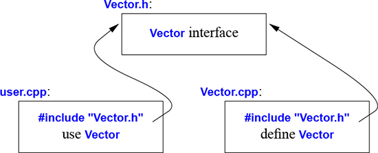

# 3 Մոդուլյարություն

_Մի՛ ընդհատեք ինձ, քանի դեռ ե՛ս եմ ընդհատում։_

_— Ուինսթոն Ս. Չերչիլ_


* Ներածություն
* Անջատ կոմպիլյացիա
* Մոդուլներ
* Անունների տիրույթներ
* Սխալների մշակում
    Բացառություններ; Ինվարիանտներ; Սխալների մշակման այլընտրանքներ; Կոնտրակտներ; Ստատիկ պնդումներ
* Ֆունկցիայի արգումենտներ և վերադարձրած արժեքներ
    Արգումենտների փոխանցում; Վերադարձրած արժեք; Structured binding
* Խորհուրդներ


## 3.1 Ներածություն

C++ լեզվով գրված ծրագիրը բաղկացած է բազմաթիվ առանձին մշակված մասերից, ինչպիսիք են ֆունկցիաները (§1.2.1), օգտագործողի սահմանած տիպերը ([Գլուխ 2](ch-02-user-defined-types.md)), դասերի հիերարխիան (§4.5) և կաղապարները ([Գլուխ 6](ch-06-templates.md))։ Այս ամենը հաջող կառավարելու համար կարևոր է հստակ սահմանել բոլոր մասերի փոխհարաբերությունները։ Առաջին և ամենակարևոր քայլը որևէ բաղադրիչի ինտերֆեյսի և դրա իրականացման հստակ տարանջատումն է։ Լեզվի մակարդակում C++-ը ինտերֆեյսերը ներկայացնում է հայտարարությունների միջոցով։ _Հայտարարությամբ_ որոշվում է այն ամենը, ինչ հարկավոր է ֆունկցիան կամ տիպն օգտագործելու համար։ Օրինակ․

```c++
double sqrt(double);  // քառակուսի արմատի ֆունկցիան ստանում է double
                      // արժեք և վերադարձնում է double արժեք

class Vector {
    public:
        Vector(int s);
        double& operator[] (int i);
        int size();

    private:
        double* elem;      // elem֊ը ցույց է տալիս sz քանակի double արժեքներով զանգվածի վրա
        int sz;
};
```

Այստեղ էական է այն, որ ֆունկցիաների մարմինները՝ դրանց _սահմանումները_, գտնվում են «ինչ-որ այլ տեղ»։ Այս օրինակի համար թերևս կուզենայինք, որ `Vector`֊ի ներկայացումը նույնպես լիներ «մի ուրիշ տեղ», բայց այդ հարցը կքննարկենք քիչ ավելի ուշ (վերացական տիպեր; §4.3)։ `sqrt()`-ի սահմանումը կունենա հետևյալ տեսքը․

```c++
double sqrt(double d)         // sqrt()֊ի սահմանումը
{
    // ․․․մաթեմատիկայի դասագրքում գրված ալգորիթմը․․․
}
```

`Vector`֊ի համար պետք է սահմանենք բոլոր երեք ֆունկցիա֊անդամները․

```c++
Vector::Vector(int s)            // կոնստրուկտորի սահմանումը
    :elem{new double[s]}, sz{s}   // արժեքավորել անդամները
{
}

double& Vector::operator[] (int i)  // ինդեքսի օպերատորի սահմանումը
{
    return elem[i];
}

int Vector::size()                  // size()֊ի սահմանումը
{
    return sz;
}
```

Մենք պետք է սահմանենք `Vector`-ի ֆունկցիաները, բայց ոչ `sqrt()` ֆունկցիան, քանի որ այն ստանդարտ գրադարանի մաս է։ Այնուամենայնիվ, դա ոչ մի էական նշանակություն չունի. գրադարանը պարզապես «մի կոդ է, որն օգտագործում ենք»՝ իրականացված լեզվի նույն գործիքներով, որոնք մենք ենք օգտագործում։

Որևէ էության համար, ինչպիսին ֆունկցիան է, կարող են լինել շատ հայտարարություններ, բայց միայն մեկ սահմանում։


## 3.2 Անջատ կոմպիլյացիա

C++ լեզուն ապահովում է անջատ կոմպիլյացիայի հնարավորությունը, երբ թարգմանվող կոդը տեսնում է միայն օգտագործվող տիպերի և ֆունկցիաների հայտարարությունները։ Այդ տիպերի և ֆունկցիաների սահմանումները գտնվում են այլ ֆայլերում և թարգմանվում են առանձին։ Այս հնարավորությունը կարող է օգտագործվել ծրագիրը որպես կիսաանկախ կոդի հատվածների բազմություն կազմակերպելու համար։ Այսպիսի առանձնացումը կարող է օգտագործվել կոմպիլյացիայի ժամանակը նվազեցնելու, ինչպես նաև ծրագրի տրամաբանորեն անկախ մասերը հստակ առանձանցնելու համար (դրանով իսկ նվազեցնելով սխալների հավանականությունը)։ Գրադարանը հաճախ առանձին թարգմանված կոդերի հատվածների (օր․ ֆունցիաների) հավաքածու է։

Սովորաբար մոդուլի ինտերֆեյսը որոշող հայտարարությունները գրառում ենք մի ֆայլում, որի անունն արտացոլում է կիրառության նպատակը։ Օրինակ․

```C++
// Vector.h:

class Vector {
public:
    Vector(int s);
    double& operator[] (int i);
    int size();
private:
    double* elem;     // elem֊ը ցույց է տալիս double տիպի sz տարրերի զանգվածի վրա
    int sz;
};
```

Այս հայտարարությունը գրառվում է `Vector.h` ֆայլում։ Այնուհետև, `Vector`-ի ինտերֆեյսը հասանելի դարձնելու համար, օգտագործողները _կցում_ են (include) այդ _վերնագրային ֆայլը_ (header file)։ Օրինակ․

```C++
// user.cpp:

#include "Vector.h"  // ստանալ Vector֊ի ինտերֆեյսը
#include <cmath>     // ստանալ ստանդարտ գրադարանի մաթեմատիկական
                     // ֆունկցիաների ինտերֆեյսը՝ ներառյալ sqrt() ֆունկցիայինը

double sqrt_sum(Vector& v)
{
    double sum = 0;
    for (int i = 0; i != v.size(); ++i)
        sum += sqrt(v[i]);   // քառակուսի արմատների գումարը
    return sum;
}
```

Կոմպիլյատորի աշխատանքի համաձայնեցվածությունն ապահովելու համար `Vector`֊ի իրականացումը պարունակող `.cpp` ֆայլում նույնպես կցվում է ինտերֆեյսը նկարագրող `.h` ֆայլը․

```C++
// Vector.cpp:

#include "Vector.h"   // կցում ենք ինտերֆեյսը

Vector::Vector (int s)
    :elem {new double[s]}, sz{s}       // ինիցիալիզացնում ենք անդամները
{
}

double& Vector::operator[] (int i)
{
    return elem[i];
}

int Vector::size()
{
    return sz;
}
```

`user.cpp` և `Vector.cpp` ֆայլերի կոդերը համատեղ օգտագործում են `Vector.h`-ում ներկայացված ինտերֆեյսը, բայց այլ տեսակետից այդ երկու ֆայլերն իրարից լիովին անկախ են և կարող են առանձին թարգմանվել։ Գրաֆիկորեն ծրագրի հատվածները կարող են ներկայացվել այսպես․



Ճիշտն ասած, անջատ կոմպիլյացիայի կիրառությունը լեզվի խնդիր չէ. դրա նպատակը լեզվի կոնկրետ իրականացման հնարավորություններն ավելի լավ օգտագործելն է։ Այնուամենայնիվ այն ունի մեծ գործնական նշանակություն։ Ծրագրի կազմակերպման լավագույն մոտեցումը այն որպես ճիշտ սահմանված (well-defined) կախվածություններով մոդուլների բազմություն պատկերացնելն է՝ այդ մոդուլյարությունը տրամաբանորեն ներկայացնելով լեզվի հնարավորություններով, ապա նույն այդ մոդուլյարությունը ֆիզիկապես ներկայացնել ֆայլերով՝ արդյունավետ անջատ կոմպիլյացիայի համար։ ??

Ինքնուրույն թարգմանվող `.cpp` ֆայլը (ներառյալ կցված վերնագրային ֆայլերը) կոչվում է _թարգմանության միավոր_ (translation unit)։ Ծրագիրը կարող է բաղկացած լինել հազարավոր թարգմանության միավորներից։


## 3.3 Մոդուլներ (C++20)

`#include` հրահանգի օգտագործումը շատ երկար պատմությունը ունի, հակված է սխալների և ծրագիրը տարբեր մասերից կառուցելու բավականին թանկ եղանակ է։ Եթե `header.h` ֆայլը `#include` հրամանով կցեք 101 թարգմանության միավորի, ապա կոմպիլյատորը 101 անգամ էլ կմշակի `header.h`-ի տեքստը։ Եթե `header1.h` ֆայլը կցեք `header2.h` ֆայլից առաջ, ապա `header1.h`-ի հայտարարություններն ու մակրոները կարող են ազդել `header2.h`-ի իմաստի վրա։ Եվ հակառակը՝ եթե `header2.h` ֆայլն եք կցել `header1.h` ֆայլից առաջ, ապա `header2.h`-ը կարող է ազդել `header1.h`-ի կոդի վրա։ Ակնհայտ է, որ սա կատարյալ եղանակ չէ, և փաստացի, 1972 թվականից սկսած, երբ այդ մեխանիզմը ներմուծվել է C լեզվում, այն եղել է թարգմանության արժեքի ու սխալների հիմնական աղբյուրը։

Մենք կարծես թե վերջապես մոտ ենք C++ լեզվում ֆիզիկական մոդուլների ներկայացման ավելի լավ եղանակ ունենալուն։ `module` կոչվող լեզվական հնարավորությունը դեռ ISO C++ ստանդարտի մաս չէ, բայց արդեն ներկայացված է որպես ISO տեխնիկական նկարագրություն (ISO Technical Specification) [ModulesTS]։ Արդեն որոշ իրականացումներ կիրառության մեջ են մտել, և այդ պատճառով էլ ես համարձակվում եմ `module`-ները ներկայացնել այստեղ՝ չնայած այն մեծ հավանականությանը, որ ինչ-որ ճշտումներ այնուամենայնիվ կարվեն, և միգուցե պետք կլինեն մի քանի տարիներ, մինչև մոդուլները կօգտագործվեն արտադրական կոդերում։ `#include` հրահանգներ օգտագործող հին կոդը կարող է դեռ շատ երկար «ապրել», քանի որ դրա արդիականացումը կարող է ժամանակատար ու ծախսատար լինել։

Դիտարկենք, թե ինչպես կարելի է `module`-ների օգտագործմամբ արտահայտել §3.2-ի `Vector`-ի և `sqrt_sum()`-ի օրինակը.

```C++
// Vector.cpp ֆայլը

module;  // այս թարգմանության միավորը սահմանում է մոդուլ

// ... այստեղ կգրենք այն ամենը, ինչ հարկավոր է Vector-ի իրականացման համար ...

export module Vector;  // "Vector" անունով մոդուլի սահմանումը

export class Vector {
public:
    Vector(int s);
    double& operator[](int i);
    int size();
private:
    double* elem;     // elem-ը ցուցիչ է sz հատ double-երի զանգվածին
    int sz;
};

Vector::Vector(int s)
    :elem{new double[s]}, sz{s}   // անդամների արժեքավորումը
{
}

double& Vector::operator[](int i)
{
    return elem[i];
}

int Vector::size()
{
    return sz;
}

export int size(const Vector& v) { return v.size(); }
```

Այստեղ սահմանված է `Vector` անունով `module`-ը, որը տրամադրում է (exports) `Vector` դասը, նրա բոլոր ֆունկցիա-անդամները, և `size()` ֆունկցիան։

Այս սահմանված մոդուլն օգտագործելու համար պետք է այն `import` հրահանգով ներմուծենք մեզ հարկավոր տեղում։ Օրինակ.

```C++
// user.cpp ֆայլը

import Vector;         // ներմուծել Vector-ի ինտերֆեյսը
#include <cmath>       // կցել ստանդարտ գրադարանի մաթեմատիկական ֆունկցիաների ինտերֆեյսը, ներառյալ sqrt()-ինը

double sqrt_sum(Vector& v)
{
    double sum = 0;
    for (int i=0; i!=v.size(); ++i)
        sum += std::sqrt(v[i]);   // քառակուսի արմատների գումարը

    return sum;
}
```

Ես կարող էի `import`-ի օգնությամբ ներմուծել ստանդարտ գրադարանի մաթեմատիկական ֆունկցիաների հայտարարությունները նույնպես, բայց օգտագործեցի հին ոճի `#include`-ը՝ պարզապես ցույց տալու համար որ հին ու նոր եղանակերը կարելի է համատեղել։ Այսպիսի համատեղումը կարևոր է հին `#include`-ներով կոդը նոր `import`-ներով կոդի աստիճանական ձևափոխման համար։

Վերնագրային ֆայլերի ու մոդուլների տարբերությունը միայն գրելաձևի մեջ չէ։

* Մոդուլը կոմպիլյացվում է միայն մեկ անգամ (այլ ոչ թե ամեն մի թարգմանության միավորի հետ, որտեղ այն օգտագործվում է)։
* Երկու մոդուլներ կարող են ներմուծվել կամայական հաջորդականությամբ՝ առանց իրենց իմաստը փոխելու։
* Եթե ինչ-որ բան ներմուծել եք մոդուլ, ապա այդ ներմուծածը մատչելի չէ ձեր մոդուլի օգտագործողներին. ներմուծումը տրանզիտիվ չէ։

Մոդուլների ազդեցությունը կոդի սպասարկելիության և կոմպիլյացիայի ժամանակի արտադրողականության վրա կարող է շատ տպավորիչ լինել։

## 3.4 Անունների տիրույթներ

Ի լրումն ֆունկցիաների (§1.3), դասերի (§2.3) և թվարկումների (§2.5), C++ լեզուն _անունների տիրույթներն_ (namespace) առաջարկում է որպես մի մեխանիզմ՝ նշելու համար, որ որոշ արտահայտություններ կապված են միմյանց և նրանց անունները չպետք է շփոթվեն այլ անունների հետ։ ?? Օրինակ, ես կարող եմ մի այդպիսի փորձ անել իմ սեփական կոմպլեքս թվերի տիպի հետ․ (§4.2.1, §14.4):

```C++
namespace My_code {
    class complex {
        // ...
    };

    complex sqrt(complex);
    // ...
    int main();
}

int My_code::main()
{
    complex z{1,2};
    auto z2 = sqrt(z);
    std::cout << '{' << z2.real() << ',' << z2.imag() << "}\n";
    // ...
}

int main()
{
    return My_code::main();
}
```

Իմ կոդը `My_code` առանձին անունների տիրույթի մեջ վերցնելով, ես վստահեցնում եմ, որ իմ անունները հակասության մեջ չեն մտնում ստանդարտ գրադարանի անունների հետ, որոնք գտնվում են `std` անունների տիրույթում (§3.4)։ Սա խելամիտ զգուշավորություն է, քանի որ ստանդարտ գրադարանը նույնպես պարունակում է `complex` թվերի թվաբանության հնարավորություններ (§4.2.1, §14.4)։

Որևէ անունների տիրույթում գտնվող անվանը դիմելու ամենապարզ եղանակը նրա անունը անունների տիրույթով լրացնելն է (օր․ `std::cout` և `My_code::main`)։ «Իրական `main()`-ը» սահմանված է անունների գլոբալ տիրույթում, այսինքն այն լոկալ չէ սահմանված անունների տիրույթում, դասում կամ ֆունկցիայում։ ???

Եթե անունների տիրույթների անունների բազմակի օգտագործումը ձանձրացնում է կամ ուշադրություն է շեղում, ապա այն ընթացիկ անունների տիրույթ կարելի է ներմուծել `using` հրահանգով․

```C++
void my_code(vector<int>& x, vector<int>& y)
{
    using std::swap;        // ստանդարտ գրադարանի swap-ը
    // ...
    swap(x,y);              // std::swap()
    other::swap(x,y);       // մի ուրիշ swap()
    // ...
}
```

`using`-հայտարարությունը ինչ-որ անունների տիրույթի անունը կիրառելի է դարձնում այնպես, կարծես թե այն հայտարարված է եղել իր օգտագործման անունների տիրույթում։ `using std::swap` արտահայտությունից հետո `swap`-ի կիրառության գրելաձևը ճիշտ այնպիսին է, ինչպես այն կլիներ `my_code()`-ում հայտարարելիս։

Ստանդարտ գրադարանի բոլոր անունները հասանելի դարձնելու համար կարող ենք օգտագործել հետևյալ `using` հրահանգը.

```C++
using namespace std;
```

`using` հրահանգը անվանված տիրույթի չդասակարգված (unqualified) անունները հասանելի է դարձնում այն տիրույթում, որում ինքն օգտագործված է։ Այսինքն, `std`-ի համար գրված `using` հրահանգից հետո, կարող ենք `std::cout`-ի փոխարեն պարզապես գրել `cout`։ `using` հրահանգի օգտագործմամբ կորցնում ենք տվյալ անունների տիրույթի անունների ընտրողաբար կիրառման հնարավորությունը, այդ պատճառով էլ այս միջոցը պետք է զգուշորեն օգտագործել, որպես կանոն միայն այնպիսի գրադարանի համար, որը լայնորեն օգտագործվում է ծրագրում (օր. `std`) կամ էլ այնպիսի ծրագրի ձևափոխության դեպքում, որը անունների տիրույթներ չի ունեցել։

Անունների տիրույթները առավելապես օգտագործվում են ծրագրային խոշոր բաղադրիչները կազմակերպելու համար, ինչպիսիք են գրադարանները։ Դրանք հեշտացնում են ծրագիրը առանձին մշակված մասերից կառուցելու գործը։


## 3.5  Սխալների մշակում

Սխալների մշակումը ծավալուն ու բարդ թեմա է՝ իր խնդիրներով ու ճյուղավորումներով, որոնք դուրս են գալիս  լեզվական միջոցների տիրույթից և տարածվում են ծրագրավորման տեխնիկայի և գործիքների տիրույթում։ C++-ը, այնուամենայնիվ, որոշ օգնական հնարավորություններ տրամադրում է։ Հիմնական գործիքը հենց ինքը տիպերի համակարգն է։ Ներդրված տիպերով (օրինակ, `char`, `int`, և `double`) և հրամաններով (օրինակ, `if`, `while` և `for`) մեր ծրագրերը մանրակրկիտ կառուցելու փոխարեն կառուցում ենք նոր տիպեր (օրինակ, `string`, `map` և `regex`) և ալգորիթմներ (օրինակ, `sort()`, `find_if()` և `draw_all()`), որոնք ավելի հարմար են մեր ծրագրին։ Այսպիսի բարձր մակարդակի կառուցվածքները պարզեցնում են ծրագրավորման ընթացքը, սահմանափակում են սխալների հնարավորությունները (օրինակ, դժվար թե դուք ծառով անցման ալգորիթմը կիրառեք երկխոսության պատուհանի նկատմամբ), և մեծացնում են կոմպիլյատորի՝ սխալներ հայտնաբերելու հնարավորությունները։ C++-ի լեզվական կառուցվածքների մեծամասնությունը նախատեսված է էլեգանտ և որակյալ աբստրակցիաներ նախագծելու և իրականացնելու համար (օրինակ, օգտագործողի սահմանած տիպերը և դրանց օգտագործող ալգորիթմները)։ Այսպիսի աբստրակցիայի արդյունքներից մեկն էլ այն է, որ կատարման ժամանկ հայտնաբերվող սխալի կետը կաելի է առանձնացնել այն կետից, որտեղ ախալը մշակվելու է։ Քանի որ ծրագրերը մեծանում են, և հատկապես երբ գրադարանները ավելի լայնորեն են կիրառվում, սխալների մշակման ստանդարտները դառնում են կարևոր։ Լավ գաղափար է ձևավորել և հստակեցնել սխալների մշակման ստրատեգիան ծրագրերի մշակման ավելի վաղ փուլերում։ ???

### 3.4.1 Բացառություններ

Նորից դիտարկենք `Vector` դասի օրինակը։ Ի՞նչ _պետք է_ արվի, երբ փորձում ենք դիմել §2.3֊ում սահմանված վեկտորի սահմաններից դուրս գտնվող տարրին։

* `Vector` դասի ստեղծողը չգիտե, թե ինչպես կուզենա վարվել օգտագործողը նման իրավիճակում (վեկտորն ստեղծողը սովորաբար նույնիսկ չգիտի էլ, թե որ ծրագրում է վեկտորն աշխատելու)։
* `Vector` դասի օգտագործողը չի կարող հայտնաբերել տվյալ խնդիրը (եթե օգտագործողը կարողանար, սահմանից դուրս դիմումը տեղի չէր ունենա ընդհանրապես)։

Ենթադրելով, որ սահմաններից դուրս դիմելն այն տիպի սխալներից է, որոնց դեպքում ուզում ենք վերականգմել ծրագրի աշխատանքը, լուծումը հետևյալն է. `Vector`֊ը իրականացնողը հայտնաբերում է զանգվածի սահմանից դուրս դիմումը և տեղեկացնում է օգտագործողին դրա մասին։ Այդ դեպքում օգտագործողը կարող է համապատասխան գործողություն կատարել։ Օրինակ, `Vector::operator[]()` ֆունկցիան կարող է հայտնաբերել սահմաններից դուրս դիմման փորձն ու դուրս նետել (throw) `out_of_range` բացառությունը․

```C++
double& Vector::operator[] (int i)
{
    if (i < 0 || size() <= i)
        throw out_of_range{"Vector::operator[]"};
    return elem[i];
}
```

The throw transfers control to a handler for exceptions of type out_of_range in some function that directly or indirectly called Vector::operator[](). To do that, the implementation will unwind the function call stack as needed to get back to the context of that caller. That is, the exception handling mechanism will exit scopes and function as needed to get back to a caller that has expressed interest in handling that kind of exception, invoking destructors (§4.2.2) along the way as needed. For example:

```c++
void f(Vector& v)
{
    // ...
    try { // այստեղ բացառությունները մշակվում են ներքևում սահմանված մշակիչի միջոցով

            v[v.size()] = 7;   // փորձել դիմել v֊ից դուրս
    }
    catch (out_of_range) { // oops: out_of_range error
            // ... մշակել սահմաններից դուրս սխալը ...
    }
    // ...
}
```

Բացառությունների մշակման համար մեր նախատեսած կոդը տեղադրում ենք `try`-բլոկում։ Հավասարությունը, որը փորձել ենք կատարել `v[v.size()]`֊ի հետ վերևում, կձախողվի։ Հետևաբար `catch`- կետը, որն ապահովում է `out_of_range`֊ի համար մշակիչ, կսկսի կատարվել։ `out_of_range` տիպը սահմանված է ստանդարտ գրադարանում (<stdexcept>֊ի մեջ) և փաստացի օգտագործվում է ստանդարտ գրադարանի` կոնտեյներներին դիմող ֆունկցիաների միջոցով։

Բացառությունների մշակման մեխանիզմների օգտագործումը կարող է սխալների մշակման գործընթացը դարձնել ավելի պարզ, ավելի համակարգված և ավելի ընթեռնելի։ Այդ նպատակին հասնելու համար պետք չէ չարաշահել `try`֊հրամանները։ Սխալների մշակումը պարզ և համակարգված դարձնելու գլխավոր մեթոդը (որը կոչվում է Resource Aquisition Is Initialization) բացատրված է §4.2.2.-ում։

Այն ֆունկցիան, որը երբեք դուրս չի բերելու որևէ բացառություն կարող է հայտարարվել `noexcept`։ Օրինակ․

````c++
   void user(int sz) noexcept
   {
      Vector v(sz);
      iota(&v[0], &v[sz],1); // լցնել v֊ն 1,2,3,4... ֊ով
   }
````

Եթե բոլոր լավ նպատակներն ու ծրագրերը ձախողվեն, so that user() still throws, այդ դեպքում կանչվում է ստանդարտ գրադարանի `terminate()` ֆունկցիան` ծրագիրն անհապաղ վերջացնելու համար։


### 3.4.2 Ինվարիանտներ

Բացառությունների կիրառումը, որը սահմանից դուրս դիմելու դեպքում տալիս է ազդանշան, մի ֆունկցիայի օրինակ է, որն ստուգում է իր արգումենտը և հրաժարվում է աշխատել, քանի որ հիմնական ենթադրությունը՝ նախապայմանը, չի պահվում։ Մենք պաշտոնապես
նշել ենք `Vector`֊ի ինդեքսավորման օպերատորը, we would have said something like ‘‘the index must be in the [ 0 : siz e() ) range,’’ and that was in fact what we tested in our operator[]() . [`a:b`) գրությունը նշանակում է կիսաբաց շարք, ըստ որի `a`֊ն այդ շարքի մասն է, իսկ `b`֊ն՝ ոչ։ Ամեն անգամ, երբ սահմանում ենք ֆունկցիա, պետք է լավ մտածենք, որոնք են նրա նախապայմանները և հնարավոր է արդյոք դրանք ստուգել։

Ինչևէ, `operator[]()` ֆունկցիան գործում է `Vector` տիպի օբյեկտների հետ and nothing it does makes any sense unless the members of Vector have ‘‘reasonable’’ values. In particular, we did say ‘‘ elem points to an array of sz doubles’’ but we only said that in a comment. Այն արտահայտությունը, որը դասի համար ենթադրվում է, որ պետք է ճիշտ լինի, կոչվում է *դասի ինվարիանտ*, կամ պարզապես *ինվարիանտ*։ Կոնստրուկտորի աշխատանքն է սահմանել ինվարիանտ իր դասի համար (որպեսզի անդամ ֆունկցիաները կարողանան հենվել դրա վրա) և որպեսզի անդամ ֆունկցիաները վստահ լինեն, որ ինվարիանտները մնում են, երբ նրանք ավարտում են իրենց աշխատանքը։ Ցավոք, մեր `Vector` կոնստրուկտորը միայն մասնակի է անում իր աշխատանքը։ Այն ճիշտ ձևով ինիցիալիզացրել է `Vector`֊ի անդամները, բայց չի հաջողվել ստուգել, թե իրեն փոխանցված արգումենտներն իմաստ ունեն թե՞ ոչ։ Դիտարկենք

````c++
   Vector v(-27);
````

դեպքը։ Սա, ամենայն հավանականությամբ կարող է առաջացնել քաոս։

   Այստեղ գրված է ավելի համապատասխան սահմանումը․

````c++
   Vector::Vector(int s)
   {
      if (s < 0)
         throw length_error{};
      elem = new double[s];
      sz = s;
   }
````

Ես օգտագործում եմ ստանդարտ գրադարանի՝ `length_error` բացառությունը, որպեսզի հաղորդեմ տարրերի ոչ դրական քանակ, քանի որ ստանդարտ գարադարանի որոշ գործողություններ կիրառում են այդ բացառությունը՝ այդ տեսակի խնդիրներ հաղորդելու համար։ Եթե `new` օպերատորը չի կարողանում գտնել հիշողության տարածք առանձնացնելու համար, այն դուրս է բերում `std::bad_alloc`։ Այժմ կարող ենք գրել․

````c++
   void test()
   {
      try {
         Vector v(-27);
      }
      catch (std::length_error) {
         // գործածվել է բացասական չափ
      }
      catch (std::bad_alloc) {
         // գործածվել է հիշողության exhaustion
      }
   }
````

Դուք կարող եք սահմանել ձեր սեփական դասերը, որոնք կօգտագործվեն որպես բացառություններ և կիրականացնեն կամայական ինֆորմացիա այն կետից, որտեղ սխալը գտնվել է մինչև այն կետը, որտեղ այն կարող է մշակվել (§3.4.1)։

Հաճախ ֆունկցիան ճանապարհ չունի կատարել վերջացնել իրեն հատկացրած խնդիրը բացառության դուրս բերումից հետո։ Այդ դեպքում բացառության «մշակելը» պարզապես նշանակում է կատարել որոշակի փոքրիկ մաքրում (cleanup) և նորից դուրս գրել բացառությունը։ Բացառությունը (նորից) դուրս գրելու համար, որը գտնվել է բացառության մշակիչի կողմից, պարզապես գրում ենք `throw`; Օրինակ․

````c++
   void test()
   {
      try {
               Vector v(-27);
      }
      catch (std::length_error) {
         cout << "test failed: length error\n";
         throw;   // rethrow
      }
      catch (std::bad_alloc){
         // test()֊ը ձևավորված չէ հիշողության արտահոսքը (exhaustion) մշակելու համար
         std::terminate();   // ավարտել ծրագիրը
      }
   }
````

Ինվարիանտների գաղափարը կենտրոնական է դասերի ձևավորման համար, իսկ նախապայմանները նույն դերն են տանում ֆունկցիաների ձևավորման մեջ։ Ինվարիանտները
   * օգնում են մեզ հասկանալ հենց այն, ինչ ուզում ենք
   * ստիպում են մեզ լինել ավելի կոնկրետ, որը մեզ տալիս է հնարավորություն ստանալ ճիշտ կոդ (հարթեցումից (debugging) և տեստավորվումից հետո)։

Ինվարիանտների գաղափարն ընկած է C++ լեզվի ռեսուրսների կառավարման գաղափարների հիմքում, որոնք հենված են կոնստրուկտորների (գլուխ 4) և դեստրուկտորների (§4.2.2, §11.2) վրա։


### 3.4.3 Ստատիկ պնդումներ

Բացառությունները հայտնում են այն սխալների մասին, որոնք գտնվում են ծրագրի կատարման ժամանակ (at run time)։ Եթե սխալը հնարավոր է գտնել կոմպիլյացիայի ժամանակ, ապա սովորաբար նախընտրելի է անել հենց այդպես։ Ահա, թե ինչի համար են համակարգերի տեսակների մեծ մասը և այն գործիքները, որոնք հարմարեցնում են ինտերֆեյսերը օգտագործողի սահմանած տիպերին։ Ինչևէ, մենք կարող ենք ներկայացնել նաև պարզ ստուգումներ ուրիշ հատկությունների վրա նույնպես, որոնք հայտնի են կոմպիլյացիայի ժամանակ և հայտնենք սխալները որպես կոմպիլյացիայի սխալի հաղրդագրություններ։ Օրինակ․

````c++
   static_assert(4 <= sizeof(int)), "ամբողջ փոփոխականները շատ փոքր են"); // ստուգեք ամբողջ տիպի չափը
````

Այս պնդումը կգրի `ամբողջ փոփոխականները շատ փոքր են`, եթե չի պահպանվում `4 <= sizeof(int)` պայմանը, սա նշանակում է՝ եթե `int`֊ը այս համակարգում չունի ամենաքիչը 4 բայթ։ Սպասումների այսպիսի հայտարարությունները մենք կոչում ենք *պնդումներ*։

`static_assert` մեխանիզմը կարող է կիրառվել որպես կոնստանտ արտահայտություններ ներկայացրած ցանկացած դեպքերում (§1.7)։ Օրինակ․

````c++
   constexpr double C = 299792.458;      // կմ/վ

   void f(double speed)
   {
      const double local_max = 160.0 / (60*60);   // 160 կմ/վ = 160.0 / (60*60) կմ/վ
      static_assert(speed < C, "հնարավոր չէ գնալ այդքան արագ");   // սխալ․ արագությունը պետք է լինի հաստատուն
      static_assert(local_max < C, "հնարավոր չէ գնալ այդքան արագ");   // ճիշտ է

      //...
   }
````

Ընդհանուր առմամբ `static_assert(A,S)`֊ը տպում է `S`֊ը որպես կոմպիլյացիայի սխալի հաղորդագրություն, եթե `A`֊ն `true` չէ։

`static_assert`֊ի ամենակարևոր կիրառումները գալիս են, երբ մենք անում ենք պնդումներ այն տիպերի մասին, որոնք օգտագործվել են որպես պարամետրեր ընդհանրացված ծրագրավորման մեջ (§5.4, §11.6)։

For runtime-checked assertions, use exceptions.


## 3.6 Խորհուրդներ

* Այս գլխի նյութը մոտավորապես համապատասխանում է նրան, ինչ որ ավելի մանրամասնորեն նկարագրված է [Stroustrup,2013] գրքի 13-15 գլուխներում։
* Դրե՛ք տարբերություն հայտարարությունների (որոնք օգտագործվել են որպես ինտերֆեյս) և սահմանումների (որոնք օգտագործվել են որպես իրականացում) միջև; §3.1։
* Օգտագործե՛ք վերնագրային ֆայլեր՝ ինտերֆեյսերը ներկայացնելու և ծրագրի տրամաբանական կառուցվածքն ընդգծելու համար; §3.2։
* `#include` (ներառե՛ք) վերնագրային ֆայլը այն սկզբնական ֆայլի մեջ, որն իրականացնում է իր ֆունկցիաները; §3.2։
* Խուսափե՛ք վերնագրային ֆայլերում ոչ֊ներդրված ֆունկցիաների սահմանումներից; §3.2։
* Օգտագործե՛ք անունների տիրույթներ՝ արտահայտելու համար ծրագրի տրամաբանական կառուցվածքը; §3.3։
* Օգտագործե՛ք `using`֊դիրեկտիվները փոխանցման համար, հիմքային գրադարանների (ինչպիսին է օրինակ `std`֊ն) համար կամ լոկալ տիրույթի ներսում; §3.3։
* Մի՛ տեղադրեք `using`-դիրեկտիվը վերնագրային ֆայլի մեջ; §3.3։
* Դուրս գրե՛ք բացառություններ՝ ցույց տալու համար, որ չեք կարողանում լուծել ձեզ տրամադրված խնդիրը; §3.4։
* Օգտագործե՛ք բացառությունները սխալների մշակման համար; §3.4։
* Զարգացրե՛ք սխալների մշակման ռազմավարությունը ավելի շուտ՝ ծրագրի ձևավորման մեջ; §3.4։
* Օգտագործե՛ք որպես բացառություններ նպատակային ձևավորված օգտագործողի կողմից սահմանված տիպերը (այլ ոչ թե ներդրված տիպերը); §3.4.1։
* Մի՛ փորձեք գտնել բոլոր բացառությունները յուրաքանչյուր ֆունկցիայի մեջ; §3.4։
* Եթե Ձեր ֆունկցիան չի կարող դուրս բերել բացառություններ, հայտարարե՛ք այն որպես `noexcept`; §3.4:
* Թույլ տվեք, որ կոնստրուկտորը հաստատի ինվարիանտը և դուրս բերի այն, եթե չի կարողանում; §3.4.2։
* Ձևավորե՛ք Ձեր սխալների մշակման ռազմավարությունը ինվարիանտների շուրջ; §3.4.2։
* Այն ինչ հնարավոր է ստուգել կոմպիլյացիայի ժամանակ, սովորաբար ամենալավ ձևով ստուգվում է հենց կոմպիլյացիայի ժամանակ (օգտագործելով `static_assert`֊ը); §3.4.3։
