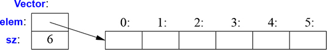

# 4 Դասեր

_Այդ տիպերը «վերացական» չեն. դրանք այնքան իրական են, որքան `int`-ը և `float`-ը:_

_— Դաֆ Մակլորի (Doug Mcllroy)_


* [Ներածություն](#4.1-Ներածություն)
* [Կոնկրետ տիպեր](#4.2-Կոնկրետ-տիպեր)
   * [Թվաբանական տիպ](#4.2.1-Թվաբանական-տիպ)
   * [Կոնտեյներ](#4.2.2-Կոնտեյներ)
   * [Կոնտեյներների սկզբնարժեքավորում](###-4.2.3-Կոնտեյներների-սկզբնարժեքավորում)
* [Վերացական տիպեր](##-4.3-Վերացական-տիպեր)
* Վիրտուալ ֆունկցիաներ
* Դասերի հիերարխիա
   * Հիերարխաների առավելությունները
   * Hierarchy Navigation
   * Avoiding Resource Leaks
* Խորհուրդներ


## 4.1 Ներածություն

Այս և հաջորդ երեք գլուխների նպատակն է ձեզ գաղափար տալ C++-ում աբստրակցիայի և ռեսուրսների կառավարման մասին՝ առանց մանրամասների մեջ մտնելու։ ??

* Այս գլխում ոչ ֆորմալ կերպով ներկայացված են նոր տիպերի (_օգտագործողի սահմանած տիպ_) սահմանման և օգտագործման եղանակները։ Մասնավորապես, այստեղ ներկայացված են _կոնկրետ դասերի_, _աբստրակտ դասերի_ և _դասերի հիերարխիաների_ հիմնական հատկությունները, իրականացման հնարավորությունները և լեզվական միջոցները։
* [Գլուխ 5](ch-05-essential-operations.md)-ը ներկայացնում է այն գործողությունները, որոնք C++-ում ունեն որոշակի իմաստ. այդպիսիներից են կոնստրուկտորները, դեստրուկտորները և վերագրումը։ Այստեղ ուրվագծվում են այն կանոնները, որոնցով դրանք համատեղ օգտագործվում են օբյեկտների կյանքի փուլերը ղեկավարելու և պարզ, արդյունավետ ու լիարժեք ռեսուրսների կառավարում իրականացնելու համար։ ??
* [Գլուխ 6](ch-06-templates.md)-ում կաղապարները ներկայացվում են որպես տիպերն ու ալգորիթմները (այլ) տիպերով ու ալգորիթմներով պարամետրիզացնելու մեխանիզմ։ Օգտագործողի սահմանած և ներդրված տիպերով հաշվարկները ներկայացված են ֆունկցիաներով, երբեմն՝ ընդհանրացված որպես _ֆունկցիաների կաղապարներ_ և _ֆունկցիա օբյեկտներ_։ ??
* [Գլուխ 7](ch-07-concepts-and-generic-programming.md)-ը ներածություն է ընդհանրացված ծրագրավորման (generic programming) սկզբունքների, տեխնիկայի և լեզվական միջոցների։ ?? Շեշտադրումն արված է _կոնցեպտների_ սահմանման և օգտագործման վրա՝ կաղապարների ինտերֆեյսների ճշգրիտ սահմանման և նախագծման։ ??? _Վարիադիկ կաղապարները_ ներկայացված են որպես առավել ընդհանուր և ճկուն ինտերֆեյսների սահմանման միջոցներ։ ??

Սրանք այն լեզվական միջոցներն են, որոնք նախատեսված են _օբյեկտներին կողմնորոշված ծրագրավորում_ և _ընդհանրացված ծրագրավորում_ կոչվող ոճերն ապահովելու համար։ [8](ch-08-library-overview.md)-[15](ch-15-concurrency.md) գլուխներում ներկայացված են ստանդարտ գրադարանի հնարավորությունների և դրանց օգտագործման օրինակներ։

C++-ին հիմնական լեզվական միջոցը _դասն_ (class) է։ Դասը օգտագործողի սահմանած տիպ է, որը նախատեսված է ծրագրի կոդում ինչ-որ հասկացություն ներկայացնելու համար։ ?? Հենց որ մեր ծրագրի նախագծում ի հայտ է գալիս ինչ-որ օգտակար հասկացություն, գաղափար, էություն և այլն, մենք փորձում ենք այն ծրագրում ներկայացնել դասի տեսքով այնպես, որ այդ գաղափարը երևա կոդում, այլ ոչ թե պարզապես մեր գլխում, նախագծման փաստաթղթում կամ ինչ-որ մեկնաբանության մեջ։ ?? Դասերի ճիշտ ընտրված բազմությամբ կառուցված ծրագիրը շատ ավելի հեշտ է հասկանալ և պահել ճիշտ վիճակում,  քան այն, որտեղ ամեն ինչ ուղղակիորեն կառուցված է ներդրված տիպերի միջոցով։ ?? Մասնավորապես, գրադարանները սովորաբար բաղկացած են հենց դասերից։ ??

Ըստ էության, բոլոր լեզվական հնարավորությունները, ի թիվս հիմնարար տիպերի, գործողությունների (operator) և հրամանների (statement), գոյություն ունեն ավելի լավ դասեր սահմանելու կամ դրանք ավելի հարմար օգտագործելու համար։ «Ավելի լավ» ասելով ես նկատի ունեմ ավել ստույգ, հեշտ սպասարկվող, ավելի արդյունավետ, ավելի էլէգանտ, հեշտ օգտագործելի, հեշտ ընթեռնելի և easier to reason about։ ??? Ծրագրավորման հնարքների մեծամասնությունը ապավինում է որոշակի տեսակի դասերի նախագծմանն ու իրականացմանը։ Ծրագրավորողների կարիքներն ու ճաշակները չափազանց տարբեր են։ Հետևաբար դասերի աջակցումն էլ բազմազան է։ ?? Այստեղ կդիտարկենք միայն դասերի երեք կարևոր տիպերի հիմնական հատկությունները.

* Կոնկրետ դասեր (§4.2),
* Աբստրակտ դասեր (§4.3),
* Դասերը դասերի հիերարխիայի մեջ (§4.5)։

Պարզվում է, որ ապշեցուցիչ քանակի օգտակար դասեր են պատկանում այս երեք տեսակներից որևէ մեկին։ Էլ ավելի շատ դասեր կարող են դիտարկվել որպես այս երեք տեսակների ավելի պարզ տարբերակներ կամ որպես այս երեքում օգտագործված հնարքների համադրությամբ իրականացվածներ։ ???


## 4.2 Կոնկրետ տիպեր

_Կոնկրետ դասերի_ (concrette class) հիմնական գաղափարն այն է, որ նրանք իրենց պահում են «ճիշտ ինչպես ներդրված տիպերը»։ Օրինակ, կոմպլեքս թվերի տիպը և անվերջ ճշտությամբ ամբողջ թվերի տիպը շատ նման են ներդրված `int`-ին, բայց այն, իհարկե, որ դրան ունեն իրենց սեփական իմաստն (semantics) ու գործողությունների բազմությունը։ Նմանապես, `vector`-ը և `string`-ը շատ նման են ներդրված զանգվածներին, բացի այն, որ դրանք իրենց ավելի լավ են պահում (§9.2, §10.3, §11.2)։

Կոնկրետ տիպի որոշիչ բնութագիրն այն է, որ նրա ներկայացումը նրա սահմանման մասն է։ Շատ կարևոր դասերում, ինչպիսին է `vector`-ը, այդ ներկայացումը միայն մեկ կամ ավելի ցուցիչներ են, որոնք ցույց են տալիս ինչ-որ այլ տեղ պահված տվյալների, բայց այդ ներկայացում առկա է կոնկրետ դասի յուրաքանչյուր օբյեկտում։ ?? Դա հնարավորություն է տալիս իրականացումներին ժամանակի ու տարածության մեջ լինել առավել արդյունավետ։ Մասնավորապես, դա մեզ հնարավորություն է տալիս.

* կոնկրետ տիպերի օբյեկտները տեղավորել ստեկում, ստատիկ առանձնացված հիշողությունում այլ օբյեկտներում (§1.5),
* օբյեկտներին հղվել ուղղակիորեն (այլ ոչ միայն ցուցիչներով կամ հղումներով),
* անմիջապես ու լիարժեք սկզբնարժեքավորել օբյեկտները (այսինքն, կոնստրուկտորների օգտագործմամբ, §2.3), և
* պատճենել և փոխանակել օբյեկտները (§5.2)։

Ներկայացումը կարող է փակ (private) լինել (ինչպես `Vector`-ի համար է; §2.3) և հասանելի լինել միայն անդամ ֆունկցիաներով, բայց այն առկա է։ ?? Հետևաբար, եթե ներկայացումը ինչ-որ նշանակալի ձևով փոխվում է, օգտագործող կոդը պետք է նորից կոմպիլյացվի։ Սա այն գինն է, որ պետք է վճարել ներդրված տիպերին նման կոնկրետ տիպեր ունենալու համար։ Այն տիպերի համար, որոնք հաճախ չեն փոխվում, և որտեղ լոկալ փոփոխականները ապահովում են անհրաժեշտ հստակությունը, սա ընդունելի է և հաճած՝ իդեալական։ Ճկունություննը մեծացնելու համար կոնկրետ տիպը կարող է իր ներկայացման հիմնական մասը պահել ազատ հիշողության մեջ (դինամիկ հիշողություն, heap) և դրան հասանելություն ապահովել դասի օբյեկտի մեջ պահվող մասերից։ ?? Հենց այդպես են իրականացված `vector`-ն ու `string`-ը. դրանք կարող են դիտարկվել որպես ռեսուրսների handle` խնամքով մշակված ինտերֆեյսով։ ???

### 4.2.1 Թվաբանական տիպ

«Օգտագործողի սահմանած դասական տիպ» է `complex`:

```C++
class complex {
    double re, im; // representation: two doubles
public:
    complex(double r, double i) : re{r}, im{i} {}    // construct complex from two scalars
    complex(double r) :re{r}, im{0} {}              // construct complex from one scalar
    complex() :re{0}, im{0} {}                      // default complex: {0,0}

    double real() const { return re; }
    void real(double d) { re=d; }
    double imag() const { return im; }
    void imag(double d) { im=d; }

    complex& operator+=(complex z)
    {
        re += z.re;         // add to re and im
        im += z.im;
        return *this;     // and return the result
    }

    complex& operator−=(complex z)
    {
        re −= z.re;
        im −= z.im;
        return *this;
    }

    complex& operator*=(complex);    // defined out-of-class somewhere
    complex& operator/=(complex);    // defined out-of-class somewhere
};
```

Սա ստանդարտ գրադարանի `complex` դասի (§14.4) մի քիչ պարզեցված տարբերակն է։ Դասի սահմանումն իրենով պարունակում է միայն ներկայացմանը հասանելիություն ապահովող գործողություններ։ Ներկայացումը պարզ ու ավանդական է։ Գործնական նկատառումներից ելնելով այն պետք է համատեղելի լինի նրան, ինչ Ֆորտրանն առաջարկել է 60 տարի առաջ, և մեզ պետք են ավանդական օպերատորները։ ?? Ի լրումն տրամաբանական պահանջների, `complex`-ը պետք է արդյունավետ լինի, այլապես այն կմնա չպահանջված։ Սրանից հետևում է, որ պարզ գործողությունները պետք է ներդրվող ? (inline) լինեն։ Այսինքն՝ պարզ գործողությունները (ինչպիսիք են կոնստրուկտորները, `+=`-ը և `imag()`-ը) գեներացված մեքենայական կոդում պետք է իրականացվեն առանց ֆունկցիաների կանչերի։ Դասի մեջ սահմանված ֆունկցիաները լռելությամբ ներդրվող են։ Հնարավոր է բացահայտ պահանջել ֆունկցիայի ներդրվող լինելը՝ դրա հայտարարության սկզբում ավելացնելով `inline` ծառայողական բառը։ Արդյունաբերական մակարդակի `complex` դասը (ինչպիսին է ստանդարտ գրադարանինը) խնամքով իրականացված է համապատասխան ներդրումներն անելու համար։ ??

Այն կոնստրուկտորը, որ կարող է գործարկվել առանց արգումենտների, կոչվում է _լռելության կոնստրուկտոր_ (default constructor)։ Այսինքն՝ `complex()`-ը `complex`-ի լռելության կոնստրուկտորն է։ Լռելության կոնստրուկտորի սահմանումով դուք բացառում եք այդ տիպում չարժեքավորված փոփոխականների առկայության հնարավորությունը։

Իրական ու կեղծ մասերը վերադարձնող ֆունկցիաների `const` հատկանիշները ցույց են տալիս, որ այդ ֆունկցիաներ չեն փոխում այն օբյեկտը, որի համար կանչվել են։ `const` հատկությամբ անդամ ֆունկցիան կարող է կանչվել ինչպես `const`, այնպես էլ ոչ-`const` օբյեկտների համար, բայց ոչ-`const` անդամ ֆունկցիան կարող է կանչվել միայն ոչ-`const` օբյեկտի համար։ Օրինակ.

```C++
complex z = {1,0};
const complex cz {1,3};
z = cz;                  // լավ է. վերագրում ոչ-const փոփոխականի
cz = z;                  // սխալ. complex::operator=()-ը ոչ-const անդամ ֆունկցիա է
double x = z.real();     // լավ է. complex::real()-ը const անդամ ֆունկցիա է
```

Շատ օգտտակար գործողություններ ուղղիղ հասանելիություն չեն պահանջում `complex`-ի ներկայացմանը, այսինքն դրանք կարող են սահմանվել դասի սահմանումից առանձին.

```C++
complex operator+(complex a, complex b) { return a+=b; }
complex operator−(complex a, complex b) { return a−=b; }
complex operator−(complex a) { return {−a.real(), −a.imag()}; }    // ունար մինուս
complex operator*(complex a, complex b) { return a*=b; }
complex operator/(complex a, complex b) { return a/=b; }
```

Այստեղ ես օգտագործում եմ այն փաստը, որ որպես արժեք փոխանցված արգումենտը պատճենվում է և ես կարող եմ փոփոխել արգումենտն առանց կանչող ֆունկցիայի նմուշի վրա ազդելու, և արդյունք օգտագործել որպես վերադարձվող արժեք։ ??

`==` և `!=` գործողությունների սահմանումը շատ պարզ է.

```C++
bool operator==(complex a, complex b)     // հավասար է
{
    return a.real()==b.real() && a.imag()==b.imag();
}

bool operator!=(complex a, complex b)     // հավասար չէ
{
     return !(a==b);
}

complex sqrt(complex);     // the definition is elsewhere

// ...
```

`complex` դասը կարող է օգտագործվել հետևյալ կերպ.

```C++
void f(complex z)
{
    complex a {2.3};       // 2.3-ից կառուցել {2.3,0.0}
    complex b {1/a};
    complex c {a+z*complex{1,2.3}};
    // ...
    if (c != b)
        c = −(b/a)+2*b;
}
```

Կոմպլեքս թվեր հետ աշխատող գործողությունները կոմպիլյատորը փոխարինում է համապատասխան ֆունկցիաների կանչերով. Օրինակ, `c!=b`-ն նշանակում է `operator!=(c,b)`, իսկ `1/a`-ն նշանակում է `operator/(complex{1},a)`։

Օգտագործողի սահմանած գործողությունները («գերբեռնված գործողությունները», «overloaded operations») պետք է օգտագործել զգույշ և խելամտորեն։ Շարահյուսությունը հաստատված է լեզվի կողմից, այսինքն՝ չեք կարող սահմանել ունար `/`։ Բացի այդ, հնարավոր չէ փոխել ներդրված տիպերի գործողությունների իմաստը, այսինքն՝ չեք կարող `int`-երի համար վերասահմանել `+`-ը։


### 4.2.2 Կոնտեյներ

_Կոնտեյները_ տարրերի հավաքածու պարունակող օբյեկտ է։ `Vector` դասը կոնտեյներ է, որովհետև `Vector` տիպի օբյեկտներ կոնտեյներներ են։ Ինչպես սահմանված է §2.3-ում, `Vector`-ը պարզապես `double`-երի անիմաստ կոնտեյներ չէ. այն պարզ է հասկանալու համար, սահմանում է օգտակար ինվարիանտ (§3.5.2), տրամադրում է սահմանների ստուգումով տարրերի հասանելիություն (§3.5.1), և իր տարրերը թվարկելու համար տրամադրում է `siae()` հատկությունը։ ?? Այնուամենայնիվ, այն ունի մի ճակատագրական թերություն. այն տարրերի համար հիշողություն է առանձնացնում `new` գործողությամբ, բայց երբեք չի ազատում այդ հիշողությունը։ Դա լավ գաղափար չէ, քանի որ, չնայած C++-ը ինտերֆեյս է սահմանում աղբի հավաքման (garbage collection, §5.3) մեխանիզմի համար, այն չի երաշխավորում, որ այդպիսի մեխանիզմն առկա է, որն էլ թույլ կտար չօգտագործվող հիշողությունը հասանելի դարձնել նոր օբյեկտների համար։ ?? Որոշ միջավայրերում չեք կարող աղբի հավաքման մեխանիզմն օգտագործել, և հաճախ, տրամաբանական կամ արտադրողականության պատճառներով, նախընտրում եք հիշողության ազատման ավելի ճշգրիտ հսկողություն։ ??? Մեզ հարկավոր է մի միջոց, որը թույլ կտա համոզված լինել, որ կոնստրուկտորում առանձնացված հիշողությունը ազատվում է. այդ միջոցը _դեստրուկտորն_ է։

```C++
class Vector {
public:
    Vector(int s) :elem{new double[s]}, sz{s}     // կոնստրուկտոր. ձեռք բերել ռեսուրսները
    {
        for (int i=0; i!=s; ++i)      // արժեքավորել տարրերը
            elem[i]=0;
    }

    ~Vector() { delete[] elem; }   // դեստրուկտոր. ազատել ռեսուրսները

    double& operator[](int i);
    int size() const;

private:
    double* elem;     // elem-ը ցույց է տալիս sz հատ  double-երի
    int sz;
};
```

Դեստրուկտորի անունը կազմված է լրացման օպերատորի նշանից, `~`, և դասի անունից. այն կոնստրուկտորին լրացնող գործողությունն է։ `Vector`-ի կոնստրուկտորը, `new` գործողության օգտագործմամբ, հիշողության ազատ տիրույթից (_դինամիկ հիշողություն_ կամ _heap_) առանձնացնում է որոշակի չափի կտոր։ Դեստրուկտորն ազատում է այդ հիշողությունը `delete[]` գործողությամբ։ Սովորական `delete`-ը մաքրում է անհատական օբյեկտները, իսկ `delete[]` տարբերակը մաքրում է օբյեկտների զանգվածը։ ??

Այս ամենն արվում է առանց `Vector`- ի օգտագործողների միջամտության։ Օգտագործողները `Vector`-ները ստեղծում և օգտագործում են այնպես, ինչպես դա կանեին ներդրված տիպերի փոփոխականների հետ։ Օրինակ.

```C++
void fct(int n)
{
    Vector v(n);
    // ... օգտագործել v-ն ...
    {
        Vector v2(2*n);
        // ... օգտագործել v-ն և v2-ը ...
    } // այստեղ v2-ը քանդվում է
    // ... օգտագործել v-ն ..
} // այստեղ v-ն է քանդվում
```

`Vector`-ը անունների, ազդեցության տիրույթների, հիշողության հատկացումների, կյանքի տևողության և այլ կանոններին (§1.5) ենթարկվում է ներդրված տիպերի (ինչպիսիք են `int`-ը և `char`-ը) պես։ ?? `Vector`-ի այս տարբերակը պարզեցված է. դուրս է թողնված սխալների մշակումը, տես §3.3։ 

Կոնստրուկտոր/դեստրուկտոր միությունը շատ էլեգանտ հնարքների հիմքում է։ Մասնավորապես, այն ընկած է C++-ի ռեսուրսների ընդհանուր կառավարման շատ հնարքների հիմքում (§5.3, §13.2)։ Դիտարկենք `Vector`-ի գրաֆիկական ներկայացումը.



Կոնստրուկտորը հիշողություն է առանձնացնում `Vector`-ի տարրերի համար և դրանք պետք եղած ձևով սկզբնարժեքավորում է։ Դեստրուկտորը հետ է վերադարձնում տարրերի հիշողությունը։ _Տվյալների կառավարման այս մոդելը_ շատ հաճախ է օգտագործվում այն դեպքերում, երբ պետք է կառավարել օբյեկտի կյանքի ընթացքում տարբեր չափերի տվյալների հետ։ ??? Կոնստրուկտորում հիշողության հատկացման և դեստրուկտորում այդ հշողության ազատման տեխնիկան, որ հայտնի է _ռեսուրսի ձեռքբերումը հենց ինիցիալիզացիան է_ (resource acquisition is initialization, RAII), մեզ հնարավորություն է տալիս բացառել «մերկ `new` գործողությունները»։ Այսինքն՝ ընդհանուր կոդում խուսափել հիշողության հատկացումներից, դրանք թողնելով միայն լավ մշակված աբստրակցիաների իրականացումներում։ ?? Նույն կերպ պետք է խուսափել նաև «մերկ `delete` գործողություններից»։ Մերկ `new`-երից և մերկ `delete`-երից ազատ կոդը շատ ավելի ապահով է սխալներից և  հիշողության արտահոսքերից (§13.2)։ ??? 

### 4.2.3 Կոնտեյներների սկզբնարժեքավորում

Կոնտեյները գոյություն ունի տարրեր պահելու համար, հետևամար մեզ տարրերը կոնտեյների մեջ լցնելու հարմար եղանակ է պետք։ Կարող ենք սարքել պետք եղած քանակի տարրերով `Vector`, ապա այդ տարրերին վերագրել համապատասխան արժեքները, բայց սովորաբար այլ եղանակներն ավելի էլեգանտ են։ Այստեղ ես պարզապես կնշեմ երկու ֆավորիտներին.

* _Արժեքավորման ցուցակով կոնստրուկտոր_. արժեքավորումը կատարվում է տարրերի ցուցակից։
* `push_back()`. նոր տարրերի ավելացում հաջորդականության վերջում։

Դրանք կարող են հայտարարվել հետևյալ կերպ.

```C++
class Vector {
public:
    Vector(std::initializer_list<double>);     // արժեքավորել double-երի ցուցակով
    // ...
    void push_back(double);                    // տարրը ավելացնել վերջից, չափը ավելացնել մեկով
    // ...
};
```

`push_back()`-ը հարմար է անհայտ քանակի տարրերի ներմուծման համար։ Օրինակ.

```C++
Vector read(istream& is)
{
    Vector v;
    for (double d; is>>d;)        // d-ի մեջ կարդալ սահաող կետով արժեքներ
        v.push_back(d);         // d-ն ավելացնել v-ի մեջ
    return v;
}
```

Ներմուծման ցիկլն ավարտվում է  ֆայլի վերջին հասնելիս կամ ֆորմատավորման սխալ հանդիպելիս։ Քանի դեռ դա չի պատահել, յուրաքանչյուր կարդացված թիվ ավելացվում է `Vector`-ին այնպես, որ վերջում `v`-ի չափը դառնում է կարդացած թվերի քանակը։ Ես օգտագործեցի `for` հրամանը, այլ ոչ թե ավելի ընդունված `while`-ը, որպեսզի `d`-ի հայտարարության ազդեցության տիրույթը սահմանափակեմ ցիկլով։ Փոխանակող կոնստրուկտորով օժտված `Vector`-ի օրինակը բացատրված է §5.2.2-ում, այն հնարավորություն է տալիս պոտենցիալ հսկայական տվյալները `read()`-ից վերադարձնել շատ էժան։ ??

```C++
Vector v = read(cin);     // այստեղ Vector-ի տարրերը չեն պատճենվում
```

Թե ինչպես են `push_back()`-ը և `vector`-ի չափը փոխող այլ գործողությունները արդյունավետ իրականացված `std::vector`-ում, ներկայացված է §11.2-ում։

Արժեքավորող ցուցակով կոնստրուկտորի սահմանման մեջ օգտագործված `std::initializer_list`-ը ստանդարտ գրադարանի տիպ է, որը ծանոթ է կոմպիլյատորին. երբ `{}`-ցուցակ ենք օգտագործում, ինչպիսին է `{1, 2, 3, 4}`-ը, կոմպիլյատորը կտեղծի `initializer_list` տիպի օբյեկտ և կփոխանցի ծրագրին։ Այսինքն՝ կարող ենք գրել.

```C++
Vector v1 = {1,2,3,4,5};              // v1-ն ունի 5 տարր
Vector v2 = {1.23, 3.45, 6.7, 8};     // v2-ն ունի 4 տարր
```

Vector’s initializer-list constructor might be defined like this:

```C++
Vector::Vector(std::initializer_list<double> lst)    // արժեքավորել ցուցակով
    :elem{new double[lst.size()]}, sz{static_cast<int>(lst.size())}
{
    copy(lst.begin(),lst.end(),elem);        // lst-ց պատճենել elem-ի մեջ (§12.6)
}
```

Դժբախտաբար, չափերի ու ինդեքսների համար ստանդարտ գրադարանն օգտագործում է առանց նշանի ամբողջ թվերը, և ես ստիպված եմ արժեքավորող ցուցակի չափը `int`-ի բացահայտ ձևափոխելու համար օգտագործել այդ այլանդակ `static_cast`-ը։ ?? Սա չափից ավելի մանրախնդիր է, որովհետև հնարավորությունը, որ ձեռքով գրված ցուցակի չափը մեծ կլինի ամենամեծ ամբողջ թվից (32767՝ 16-բիթանոց թվերի համար, և 2147483647՝ 32-բիթանող ամբողջ թվերի համար) շատ փոքր է։ Այնուամենայնիվ, տիպերի համակարգը բանականությամբ օժտված չէ։ Նա գիտի փոփոխականների հնարավոր արժեքների մասին, այլ ոչ թե կոնկրետ արժեքների, և կարող է դժգոհել նույնիսկ առանց պատճառի։ Այսպիսի զգուշացումները երբեմն ծրագրավորողին կարող են պաշտպանել վատ սխալից։

`static_cast`-ը չի ստուգում, թե ինչ արժեք է ձևափոխում. ծրագրավորողը պետք է վստահ լինի դրա ճիշտ օգտագործման մեջ։ Միշտ չէ, որ սա ճիշտ ենթադրություն է, այնպես որ, եթե կասկածում եք՝ ստուգեք արժեքը։ Տիպերի բացահայտ ձևափոխություններից (often called casts to remind you that they are used to prop up something broken) ավելի լավ է խուսափել։ Փորձեք չստուգվող ձևափոխություններն օգտագործել միայն համակարգի ամենացածր մակարդակում։ Դրանք հակված են սխալների։ ??

Տիպերի այլ ձևափոխիչներ են `reinterpret_cast`-ը, որն օբյեկտը մեկնաբանում է որպես բայթերի պարզ հաջորդականությունը, և `const_cast`-ը, որը «դեն է նետում `const`-ը»։ Տիպերի համակարգի խելամիտ օգտագործումն ու ճիշտ նախագծված գրադարանները թույլ են տալիս բարձր մակարդակի ծրագրերում խուսափել տիպերի չստուգվող ձևափոխություններից։ 


## 4.3 Վերացական տիպեր

Այն տիպերը, ինչպիսիք են `complex`-ը և `Vector`-ը կոչվում են _կոնկրետ տիպեր_, քանի որ դրանց ներկայացումը սահմանման մասն է։ Այդ հատկությամբ դրանք հիշեցնում են ներդրված տիպերը։ ?? Ի հակադրություն, _վերացական տիպը_ (abstract type) օգտագործողին ամբողջովին մեկուսացնում է իր իրականացման մանրամասներից։ ?? Դա անելու համար մենք ինտերֆեյսն առանձնացնում ենք ներկայացումից և հրաժարվում ենք իսկական լոկալ փոփոխականներից։ Քանի որ մենք ոչինչ չգիտենք վերացկան տիպի ներկայացման մասին (նույնիսկ չափը չգիտենք), պետք է օբյեկտը ստեղծենք հիշողության ազատ տիրույթում (§4.2.2) և դրանց դիմենք հղումների կամ ցուցիչների միջոցով (§1.7, §13.2.1)։ ??

Նախ սահմանում ենք `Container` դասի ինտերֆեյսը։ `Container`-ը կսահմանենք որպես `Vector`-ի ավելի վերացական տարբերակ։

```C++
class Container {
public:
    virtual double& operator[](int) = 0;     // զուտ վիրտուալ ֆունկցիա
    virtual int size() const = 0;            // const անդամ ֆունկցիա (§4.2.1)
    virtual ~Container() {}                  // դեստրուկտոր (§4.2.2)
};
```

Այս դասը ավելի ուշ սահմանվելիք կոնտեյներների զուտ ինտերֆեյսն է։ `virtual` բառը նշանակում է, թե «կարող է սահմանվել ավելի ուշ, այս դասից ժառանգված դասերում»։ Զարմանալի չէ, որ `virtual` հայտարարված ֆունկցիան կոչվում է _վիրտուալ ֆունկցիա_։ `Container`-ից ժառանգված դասը տրամադրում է `Container` ինտերֆեյսի իրականացում։ Տարօրինակ `=0` գրառումն ասում է, որ ֆունկցիան _զուտ վիրտուալ_ է, այսինքն՝ `Container`-ից ժառանգված ամեն մի դաս պետք է իրականացնի այն։ Այսպիսով, հնարավոր չէ սահմանել օբյեկտ, որը պարզապես `Container` է։ Օրինակ.

```C++
Container c;                                // սխալ. վերացական դասի օբյեկտ չի կարող լինել
Container* p = new Vector_container(10);    // լավ է. Container-ը ինտերֆեյս է
```

`Container`-ը կարող է ծառայել միայն որպես իր `operator[]()` և `size()` ֆունկցիաներն իրականացնող դասի ինտերֆեյս։ Զուտ վիրտուալ ֆունկցիաներով դասը կոչվում է _վերացական դաս_ (abstract class)։

`Container`-ը կարող է օգտագործվել հետևյալ կերպ.

```C++
void use(Container& c)
{
    const int sz = c.size();

    for (int i=0; i!=sz; ++i)
        cout << c[i] << '\n';
}
```

Ուշադրություն դարձրեք, թե ինչպես է `use()`-ը օգտագործում `Container` ինտերֆեյսը՝ լիովին անտեսելով իրականացման մանրամասները։ Այն `size()`-ը և `[]`-ը օգտագործում է առանց դույզն իսկ տեղյակ լինելու, թե ինչ տիպ է տրամադրում դրանց իրականացումը։ Դասերի որոշ բազմության ինտերֆեյս տրամադրող դասին հաճախ անվանում են _պոլիմորֆ տիպ_ (polymorphic type)։ ??

Ինչպես և հատուկ է վերացական դասերին, `Container`-ը կոնստրուկտոր չունի։ Ի վերջո, այն ինիցիալիզացնելու և ոչ մի տվյալ չունի։ Մյուս կողմից էլ `Container`-ը դեստրուկտոր ունի և այդ դեստրուկտորը վիրտուալ է, այսինքն՝ `Container`-ից ժառանգված դասերը կարող են դրա համար իրականացումներ տրամադրել։ Նորից, սա հատուկ է վերացական դասերին, քանի որ դրանք նախատեսված են հղումների կամ ցուցիչների միջոցով բանեցնելու համար, և ցուցիչի միջոցով `Container`-ը ոչնչացնողը գաղափար անգամ չունի, թե ինչ ռեսուրսներ ունի իրականացումը, (տես նաև §4.5)։ ??

`Container` վերացական դասը սահմանում է միայն ինտերֆեյս բայց ոչ իրականացում։ `Container`-ից օգուտ ստանալու համար մենք պետք է իրականացնենք այդ ինտերֆեյսի ֆունկցիաներն իրականացնող կոնտեյներ։ ?? Դրա համա կարող ենք օգտագործել `Vector` կոնկրետ դասը.

```C++
class Vector_container : public Container { // Vector_container-ը իրականացնում է Container-ը
public:
    Vector_container(int s) : v(s) { }   // s տարրերի Vector
    ~Vector_container() {}

    double& operator[](int i) override { return v[i]; }
    int size() const override { return v.size(); }

private:
     Vector v;
};
```

Դասի սահմանման մեջ `:public` գրառումը կարող է ընկալվել որպես «ածանցված է» կամ «ենթատիպն է»։ Ասում են, թե `Vector_container` դասը _ածանցված է_ `Container` դասից, իսկ `Container` դասը `Vecor_container` դասի _բազային_ դասն է։ Մի այլ տերմինաբանությամբ `Vector_container`-ը և `Container`-ը համապատսխանաբար կոչվում են _ենթադաս_ (subclass) և _գերդաս_ (superclass): Ասում են նաև, թե ածանցված դասը ժառանգում է իր բազային դասի անդամները, այսինքն՝ բազային և ածանցյալ դասերի օգտագործնումը կոչվում է _ժառանգականություն_ (inheritance): ???

Ընդունված է ասել, որ `operator[]()` և `size()` անդամները _փոխարինում_ (override) են `Container` բազային դասի համապատասխան անդամներին։ ?? Ես բացահայտ գրել եմ `override` բառը, որպեսզի պարզ լինի, թե ինչ է նկատի առնված։ `override`-ի օգտագործումը պարտադիր չէ, սակայն բացահայտ գրելու դեպքում կոմպիլյատորին թույլ է տալիս բռնել այնպիսի սխալներ, ինչպիսիք են տառասխալը ֆունկցիաների անվան մեջ կամ վիրտուլ ֆունկցիայի և նրա ենթադրվող փոխարինողի տիպերի թեթևակի տարբերությունները։ ?? `override` բառի բացահայտ օգտագործումը մասնավորապես օգտակար է դասերի ընդարձակ հիերարխիաներում, որտեղ այլ դեպքերում դժվար կլինի հասկանալ, թե ով ում փոխարինողն է։ ??

Դեստրուկտորը (`~Vector_container()`) փոխարինում է բազային դասի դեստրուկտորին (`~Container()`)։ Նկատենք, որ անդամի `~Vector()` դեստրուկտորը անբացահայտ եղանակով կանչվում է իր դասի դեստրուկտորում (`~Vector_container()`)։

Որպեսզի `use(Container&)`-ի նման ֆունկցիաները `Container`-ն օգտագործեն իրականացման մասնրամասները լիովին անտեսմամբ, ինչ-որ մի ֆունկցիա պետք է ստեղծի այն օբյեկտը, որ նկատմամբ այն կրառվելու է։ ??? Օրինակ.

```C++
void g()
{
    Vector_container vc(10);     // 10 տարրերի Vector
    // ... լրացնել vc-ն ...
    use(vc);
}
```

Քանի որ `use()`-ը չգիտի `Vector_container`-ների մասին, այլ միայն գիտի `Container` ինտերֆեյսը, ապա այն նույն հաջողությամբ կաշխատի նաև `Container`-ի այլ իրականացման համար։ ?? Օրինակ.

```C++
class List_container : public Container {     // List_container-ը իրականացնում է Container
public:
    List_container() { }      // դատարկ ցուցակ
    List_container(initializer_list<double> il) : ld{il} { }
    ~List_container() {}
    double& operator[](int i) override;
    int size() const override { return ld.size(); }
private:
    std::list<double> ld;     // double—երի ցուցակ (ստանդարտ գրադարանից) (§11.3)
};

double& List_container::operator[](int i)
{
    for (auto& x : ld) {
        if (i==0)
            return x;
        −−i;
    }
    throw out_of_range{"List container"};
}
```

Այստեղ ներկայացումը ստանդարտ գրադարանի `list<double>`-ն է։ Ընդհանրապես, ես ինդեքսավորբան գործողություն ունեցող կոնտեյները չէի իրականացնի `list`-ի օգտագործմամբ, քանի որ `list`-ի ինդեքսավորման արագագործությունը ահավոր է՝ համեմատած `vector`-ի ինդեքոավորման արագագործությանը։ ?? Սակայն այստեղ ես պարզապես ուզում էի ցույց տալ մի իրականացում, որը սկզբուքորեն տարբեր է տարածվածներից։

Ֆունկցիան կարող է ստեղծել `List_container` և կիրառել `use()`-ը դրա նկատմամբ.

```C++
void h()
{
    List_container lc = { 1, 2, 3, 4, 5, 6, 7, 8, 9 };
    use(lc);
}
```

Իմաստն այն է, որ `use(Container&)`-ը գաղափար էլ չունի, թե իր արգումենտում `Vector_container` է, `List_container` է, կամ մի այն կոնտեյներ. նրան պետք էլ չէ իմանալ։ Այն կարող է օգտագործել կամայական `Container`։ Այն գիտի միայն `Container`-ով սահմանված ինտերֆեյսը։ Հետևաբար, կարիք չկա նորից թարգմանել `use(Container&)`-ը, երբ `List_container`-ի իրանացումը փոխվում է, կամ `Container`-ից ածանցված լրիվ նոր դաս է օգտագործվում։

Այս ճկունության հակառակ կողմն այն է, որ օբյեկտների հետ պետք է աշխատել ցուցիչների կամ հղումների միջոցով (§5.2, §13.2.1)։
