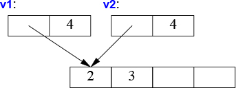
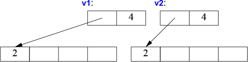
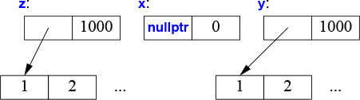

# 5 Հիմնական գործողություններ

_Երբ մեկը կասի, թե ուզում եմ այնպիսի ծրագրավորման լեզու, որտեղ ես միայն կասեմ, թե ինչ եմ ուզում, ապա նրա ձեռը մի շաքարաքլոր տվեք։_ ??

_— Ալան Պերլիս_

* [Ներածություն](#51-Ներածություն)
    * [Հիմնական գործողություններ](#511-Հիմնական-գործողություններ)
    * [Տիպերի ձևափոխություններ](#512-Տիպերի-ձևափոխություններ)
    * [Անդամների սկզբնարժեքավորիչներ](#513-Անդամների-սկզբնարժեքավորիչներ)
* [Պատճենում և տեղափոխում](#52-Պատճենում-և-տեղափոխում)
    * [Կոնտեյներների պատճենումը](#521-Կոնտեյներների-պատճենումը)
    * [Կոնտեյներների տեղափոխումը](#522-Կոնտեյներների-տեղափոխումը)
* [Ռեսուրսների կառավարում](#53-Ռեսուրսների-կառավարում)
* [Սովորական գործողություններ](#54-Սովորական-գործողություններ)
    * Comparisons
    * Container Operations
    * Input and Output Operators
    * User-Defined Literals
    * swap()
    * hash<>
* Խորհուրդներ


## 5.1 Ներածություն

Որոշ գործողություններ, ինչպիսիք են սկզբնարժեքավորումը, վերագրումը, պատճենումն ու տեղափոխումը, հիմնական են այն իմաստով, որ լեզվական կանոնները ինչ-որ նախապայմաններ ունեն դրանց համար։ Այլ գործողություններ, ինչպիսիք են, օրինակ, `==` և `<<`, ունեն սովորական իմաստ, որը վտանգավոր է անտեսել։ ??


### 5.1.1 Հիմնական գործողություններ

Շատ նախագծերում օբյեկտի կառուցումը առանցքային դեր է խաղում։ Կիրառությունների այդ ընդարձակ հնարավորություններն արտացոլվել են լեզվի՝ սկզբնարժեքավորումն ապահովող հնարավորությունների տեսականու և ճկունության վրա։

Տիպի կոնստրուկտորները, դեստրուկտորները, վերագրման ու տեղափոխման գործողությունները տրամաբանորեն անկախ չեն։ Մենք պետք է դրանք սահմանենք որպես համաձայնեցված խումբ կամ էլ տուժենք տրամաբանական ու արտադրողականության խնդիրների պատճառով։ Եթե `X` տիպն ունի ոչ հասարակ գործողություններ կատարող դեստրուկտոր, օրինակ, հիշողության ազատում կամ փականքի ազատում (lock release), ապա հավանաբար պետք է այդ դասի համար սահմանել ֆունկցիաների լրիվ հավաքածուն.

```C++
class X {
public:
    X(Sometype);            // «սովորական կոնստրուկտոր»: օբյեկտի ստեղծում
    X();                    // լռելության կոնստրուկտոր
    X(const X&);            // պատճենի կոնստրուկտոր
    X(X&&);                 // փոխանակման կոնստրուկտոր
    X& operator=(const X&); // պատճենող վերագրում. մաքրել օբյեկտը և պատճենել նոր արժեքը
    X& operator=(X&&);      // փոխանակող վերագրում. մաքրել օբյեկտը և տեղփոխել նոր արժեքը
    ~X();                   // դեստրուկտոր. մաքրող գործողություն
    // ...
};
```

Գոյություն ունեն հինգ իրավիճակներ, երբ օբյեկտը կարող է պատճենվել կամ տեղափոխվել.
* երբ այն վերագրվող արժեք է,
* երբ այն օբյեկտի սկզբնարժեքավորիչ է,
* երբ այն ֆունկցիայի արգումենտ է,
* երբ ֆունկցիայից վերադարձվող արժեք է,
* երբ բացառության օբյեկտ է։

Վերագրման ժամանակ օգտագործվում են վերագրման կամ փոխանակող վերագրման գործողությունները։ Սկզբունքորեն այլ դեպքերում կարելի է օգտագործել պատճենող կամ փոխանակող կանստրուկտորները։ Այնուամենայնիվ, պատճենող կամ տեղափոխող կանստրուկտորի կանչը սովորաբար օպտիմիզացվում է այնպես, որ արժեքավորման աջ կողմի օբյեկտը կառուցվում է հենց նպատակային օբյեկտի տեղում։

```C++
X make(Sometype);
X x = make(value);
```

Այս դեպքում կոմպիլյատորը սովորաբար `make()`-ից վերադարձվող `X`-ը կկառուցի ուղղակի `x`-ի մեջ՝ հապավելով պատճենումը։

Ի լրումն անվանված օբյեկտների և հիշողության դինամիկ տիրույթում ստեղծվող օբյեկտների սկզբնարժեքավորման, կոնստրուկտորներն օգտագործվում են ժամանակավոր օբյեկտների սկզբնարժեքավորման և տիպերի բացահայտ ձևափոխման համար։

Բացի «սովորական կոնստրուկտորը», կոմպիլյատորի կողմից այդ հատուկ ֆունկցիաները գեներացվում են ըստ անհրաժեշտության։ Եթե հատուկ ուզում եք, որ գեներացվի լռելության իրականացումը, ապա կարող եք գրել.

```C++
class Y {
public:
    Y(Sometype);
    Y(const Y&) = default;   // ես իսկապես ուզում եմ լռելության պատճենի կոնստրուկտորը
    Y(Y&&) = default;        // և լռելության տեղափոխող կոնստրուկտորը
    // ...
};
```

Եթե ընտրել եք ինչ-որ ֆունկցիաների լռելության իրականացումը, ապա այլ լռելության սահմանումներ չեն գեներացվի։ ??

եթե դասն ունի որևէ ցուցիչ անդամ, ապա սովորաբար առաջարկվում է բաահայտ իրականացնել պատճենի և տեղափոխման գործողությունները։ Պատճառն այն է, որ ցուցիչը կարող է ցույց տալ մի ինչ-որ բանի, որը դասը կուզենա ջնջել, և յդ դեպքում լռելության անդամ-առ-անդապ պատճենումը կարող է սխալ լինել։ Կամ էլ՝ ցուցիչը կարող է ցույց տալ մի բանի, որը դասը չպետք է ջնջի։ Երկու դեպքում էլ կոդը կարդացողը կուզենար դա իմանալ։ Օրինակ, տես §5.2.1։

Գործնական լավ կանոն է (երբեմն դրան ասում են _զրոյական կանոն_) կա՛մ սահմանել բոլոր հիմնական գործողությունները, կա՛մ ոչ մեկն էլ չսահմանել (բոլորի համար օգտագործել լռելության իրականացումները)։ Օրինակ.

```C++
struct Z {
    Vector v;
    string s;
};

Z z1;          // z1.v-ի և z1.s-ի լռելության արժեքավորում
Z z2 = z1;     // z1.v-ի և z1.s-ի լռելության պատճենում
```

Այս դեպքում կոմպիլյատորը, ըստ անհրաժեշտության, կգեներացնի լռելության կոնստրուկտոր, պատճենման ու տեղափոխման գործողություններ և դեստրուկտոր, և դրանք կունենան ճիշտ սեմանտիկա։ ??

Ի լրումն `= default` գրառման, գոյություն ունի նաև `= delete` գրառումը, որով նշվում է, որ գործողությունը չպետք է գեներացվի։ Դասերի հիերարխիայի բազային դասը այն դասական օրինակն է, որտեղ մենք չենք ուզում թույլ տալ անդամ-առ-անդամ պատճենոմը։ Օրինակ.

```C++
class Shape {
public:
    Shape(const Shape&) = delete;            // արգելել պատճենումը
    Shape& operator=(const Shape&) = delete;
    // ...
};

void copy(Shape& s1, const Shape& s2)
{
    s1 = s2;  // սխալ. Shape-ի պատճենումը ջնջված է
}
```

`= delete`-ի օգտագործման արդյունքում ջնջված ֆունկցիայի օգտագործման փորձը բերում է կոմպիլյացիայի ժամանակի սխալի։ `= delete`-ը կարելի է օգտագործել ոչ միայն հիմնական գործողությունների համար, այլև ցանկացած ֆունկցիայի համար։


### 5.1.2 Տիպերի ձևափոխություններ

Մեկ արգումենտով կոնստրուկտորը սահմանում է իր արգումենտի տիպի ձևափոխություն։ Օրինակ, `complex`-ը (§4.2.1) տրամադրում է `double` արգումենտով կոնստրուկտոր.

```C++
complex z1 = 3.14;  // z1-ը ստանում է {3.14, 0.0} արժեքը
complex z2 = z1*2;  // z2-ը ստանում է z1 * {2.0, 0} == {6.28, 0.0} արժեքը
```

Այս անբացահայտ ձևափոխությունը երբեմն իդեալական է, բայց ոչ միշտ։ Օրինակ, `Vector`-ն (§4.2.2) ունի `int` արգումենտով կոնստրուկտոր.

```C++
Vector v1 = 7; // լավ է. v1-ն ունի 7 տարր
```

Այսպիսի գառումը սովորաբար համարվում է անհաջող, և ստանդարտ գրադարանի վեկտորը թույլ չի տալիս `int`-ից `vector`-ի «ձևափոխություն»։

Այսպիսի խնդրից խուսափելու համար պետք է ասել, որ միայն բացահայտ «ձևափոխությունն» է թույլատրվում. այսինքն՝ կարող ենք կոնստրուկտորը սահմանել հետևյալ կերպ.

```C++
class Vector {
public:
    explicit Vector(int s);    // int-ից Vector-ի անբացահայտ ձևափոխությունն չի կարելի
    // ...
};
```

Ստանում ենք.

```C++
Vector v1(7);   // լավ է. v1-ն ունի 7 տարր
Vector v2 = 7;  // սխալ. int-ից Vector-ի անբացահայտ ձևափոխությունն չի կարելի
```

Հենց որ բանը հասնում է ձևափոխություններին՝ ավելի շատ տիպեր նման են `Vector`-ին քան `complex`-ին, հետևաբար, եթե հիմնավոր պատճառ չունեք, մեկ արգումենտով կոնստրուկտորի համար օգտագործեք `explicit`։


### 5.1.3 Անդամների սկզբնարժեքավորիչներ

Հենց որ սահմանվում է դասի անդամ-փոփոխականը, մենք կարող ենք դրա համար տրամադրել լռլության արժեքավորիչ՝ կոչված _անդամի լռելության սկզբնարժեքավորիչ_։ ??

```C++
class complex {
    double re = 0;
    double im = 0; // երկու double արժեքներ՝ 0.0 սկզբնական արժեքով
public:
    complex(double r, double i) : re{r}, im{i} {}   // complex-ը կառուցել երկու սկալյարներից. {r, i}
    complex(double r) : re{r} {}                    // complex-ը կառուցել մեկ սկալյարից. {r, 0}
    complex() {}                                    // լռելության կոնստրուկտոր {0, 0} արժեքի համար
    // ...
}
```

Երբ կոնստրուկտորով արժեքներ չեն տրվում, օգտագործվում են լռելության արժեքավորիչի արժեքները։ Սա պարզեցնում է կոդը և մեզ հնարավորություն է տալիս, որ պատահաբար փոփոխականը չթողնենք առանց սկզբնական արժեքի։ ??


## 5.2 Պատճենում և տեղափոխում

Լռելությամբ օբյեկտները կարող են պատճենվել։ Սա ճիշտ է ինչպես օգտագործողի սահմանած տիպերի, այնպես էլ ներդրված տիպերի համար։ Լռելությամբ կատարվում է անդամ-առ-անդամ պատճենում. ամեն մի անդամն առանձին պատճենվում է։ Օրինակ, օգտագործենք §4.2.1-ի `complex`-ը։

```C++
void test(complex z1)
{
    complex z2 {z1};    // պատճենող արժեքավորում
    complex z3;
    z3 = z2;            // պատճենող վերագրում
    // ...
}
```

Հիմա `z1`-ը, `z2`-ը և `z3`-ը ունեն նույն արժեքը, քանի որ թե՛ վերագրումը, թե՛ սկզբնարժեքավորումը պատճենում են դրանց երկու անդամն էլ։

Երբ դաս ենք նախագծում, ապա անպայման դիտարկում ենք, թե պե՞տք է արդյոք օբյեկտը պատճենվի, և թե ինչպես այն պետք է պատճենվի։ Պարզ կոնկրետ տիպերի համար անդամ-առ-անդամ պատճենումը սովորաբար հենց պատճենման ճիշտ իմաստն է։ Որոշ բարդ կոնկրետ տիպերի համար, ինչպիսին `Vector`-ն է, անդամ-առ-անդամ պատճենումը պատճենման ճիշտ իմաստը չէ. իսկ վերացական տիպերի համար համարյա միշտ այդպիսին չէ։ ??


### 5.2.1 Կոնտեյներների պատճենումը

Երբ դասը _ռեսուրսների նկարագրիչ_ է, այսիքն, պատասխանատու է օբյեկտի համար, որին հասանելիություն է ստանում ցուցիչի միջոցով, ապա լռելության անդամ-առ-անդամ պատճենումը սովորաբար գլխացավանք է։ Անդամ-առ-անդամ պատճենումը կարող է խախտել ռեսուրսների նկարագրիչի ինվերիանտը (§3.5.2)։ Օրինակ, լռելության պատճենումը կարող է թողնել, որ `Vector`-ի պատճենը հղվի նույն տարրերին, ինչ որ օրիգինալը։

```C++
void bad_copy(Vector v1)
{
    Vector v2 = v1;    // v1-ի ներկայացումը պատճենել v2-ի մեջ
    v1[0] = 2;         // v2[0]-ն էլ է հավասար 2-ի
    v2[1] = 3;         // v1[1]-ն էլ է հավասար 3-ի
}
```

Ենթադրենք՝ `v1`-ն ունի չորս տարր. արդյունքը գրաֆիկորեն կարելի է ներկայացնել հետևյալ կերպ.



Բարեբախտաբար, `Vector`-ի դեստրուկտոր ունենալու փաստը շատ լավ հուշում է, որ լռելության (անդամ-առ-անդամ) պատճենման սեմանտիկան սխալ է, և, այս օրինակի դեպքում, կոմպիլյատորը պետք է ամենաքիչը զգուշացում տա։ Մենք պետք է սահմանենք պատճենման ավելի լավ սեմանտիկա։

Դասի օբյեկտի պատճենման վարքը որոշվում է երկու անդամներով. պատճենի կոնստրուկտորով և պատճենող վերագրման գործողությամբ։

```C++
class Vector {
private:
    double* elem; // elem-ը ցույց է տալիս sz հատ double տարրերի
    int sz;

public:
    Vector(int s);                         // կոնստրուկտոր. հաստատել ինվարիանտը, ձեռք բերել ռեսուրսները
    ~Vector() { delete[] elem; }           // դեստրուկտոր. ազատել ռեսուրսները

    Vector(const Vector& a);               // պատճենի կոնստրուկտոր
    Vector& operator=(const Vector& a);    // պատճենող վերագրում

    double& operator[](int i);
    const double& operator[](int i) const;

    int size() const;
};
```
`Vector` դասի համար պատճենի կոնստրուկտորի ընդունելի սահմանումը պահանջված թվով տարրերի համար տեղ է առանձնացնում, ապա դրա մեջ է պատճենում տարրերը. արդյունքում `Vector`-ի ամեն մի նմուշն ունի տարրերի իր պատճենը։ ??

```C++
Vector::Vector(const Vector& a)   // պատճենող կոնստրուկտոր
    : elem{new double[a.sz]},     // տեղ առանձնացնել տարրերի համար
      sz{a.sz}
{
    for( int i = 0; i != sz; ++i )    // պատճենել տարրերը
        elem[i] = a.elem[i];
}
```

Ասվածից հետո `v2 = v1` արտահայտության արդյուքնը կարելի է ներկայացնել այսպես.



Իհարկե, ի լրումն պատճենի կոնստրուկտորի, պետք է ունենանք նաև պատճենող վերագրման գործողություն.

```C++
Vector& Vector::operator=(const Vector& a)     // պատճենող վերագրում
{
    double* p = new double[a.sz];
    for( int i = 0; i != a.sz; ++i )
        p[i] = a.elem[i];
    delete[] elem;         // ջնջել հին տարրերը
    elem = p;
    sz = a.sz;
    return *this;
}
```

Նախապես սահմանված `this` անունը անդամ ֆունկցիայում ցույց է տալիս այն օբյեկտին, որի համար անդամ ֆունկցիան կանչվում է։


### 5.2.2 Կոնտեյներների տեղափոխումը

Պատճենումը կարող ենք կառավարել պատճենի կոնստրուկտոր և պատճենող վերագրում սահմանելով, սակայն պատճենումը կարող է ծախսատար լինել մեծ օբյկտների համար։ Մենք խուսափում ենք պատճենման ծախսերից, երբ օբյեկտը ֆունկցիային ենք փոխանցում հղումով, բայց մենք չենք կարող որպես արդյունք վերադարձնել լոկալ օբյեկտի հղումը (լոկալ օբյեկտը կքանդվի, հենց որ կանչող ֆունկցիան հնարավորություն ստանա դիմել դրան): ?? Դիտարկենք հետևյալը.

```C++
Vector operator+(const Vector& a, const Vector& b)
{
    if( a.size()!=b.size() )
        throw Vector_size_mismatch{};

    Vector res(a.size());
    for( int i = 0; i != a.size(); ++i )
        res[i] = a[i] + b[i];
    return res;
}
```

`operator+`-ից վերադառնալիս արդյունքը `res` լոկալ փոփոխականից պատճենվում է մի այնպիսի տեղ, որտեղից այն հասանելի կլինի կանչող ֆունկցիային։ `+`-ը կարող ենք օգտագործել հետևյալ կերպ.

```C++
void f(const Vector& x, const Vector& y, const Vector& z)
{
    Vector r;
    // ...
    r = x + y + z;
    // ...
}
```

Այստեղ `Vector`-ը պատճենվելու է ամենաքիչը երկու անգամ (`+` գործողության ամեն մի օգտագործման համար մեկական անգամ)։ Եթե `Vector`-ը մեծ է, ասենք՝ 10000 `double`-ներով, դա արդեն կարող է մտահոգիչ լինել։ Ամենամտահոգիչն այն է, որ `operator+()`-ում պատճենումից հետո `res`-ն այլևս չի օգտագործվում։ Իրականում մեզ պատճենել պետք էլ չէ. մեզ միայն պետք է արդյունքը դուրս բերել ֆունկցիայից. մենք կուզենայինք _պատճենելու_ փոխարեն _տեղափոխել_ `Vector`-ը։ Բարեբախտաբար, կարող ենք արտահայտել այդ մտադրությունը.

```C++
class Vector {
    // ...

    Vector(const Vector& a);               // պատճենի կոնստրուկտոր
    Vector& operator=(const Vector& a);    // պատճենող վերագրում

    Vector(Vector&& a);                    // տեղափոխման կոնստրուկտոր
    Vector& operator=(Vector&& a);         // տեղափոխող վերագրում
};
```

Ունենալով այս սահմանումը՝ ֆունկցիայից վերադարձվող արժեքի դուրս բերելն իրականացնելու համար, կոմպիլյատորը կընտրի _տեղափոխման կոնստրուկտորը_։ Սա նշանակում է, որ `r = x + y + z` արտահայտության հաշվարը չի բեր `Vector`-ների պատճենման։ Դրա փոխարեն `Vector`-ները պարզապես կտեղափոխվեն։

Սովերաբար շատ հեշտ է սահմանել `Vector`-ի տեղափոխման կոնստրուկտորը.

```C++
Click here to view code image

Vector::Vector(Vector&& a)
    : elem{a.elem},          // "խլել տարրերը" a-ից
      sz{a.sz}
{
    a.elem = nullptr;       // a-ն այլևս տարրեր չունի
    a.sz = 0;
}
```

Նիշերի `&&` զույգը նշանակում է «աջակողմյան արժեքի հղում» (rvalue reference). այն հղում է, որին կարող ենք կապել աջակողմյան արժեք (rvalue): ?? rvalue բառը հակադիրն է lvalue բառի, որը պարզապես նշանակում է «ինչ-որ բան, որը կարող է հանդիպել վերագրման գործողության ձախ կողմում»։ Այսինքն, աջակողմյան արժեքը կամ r-արժեքը, առաջին մոտարկմամբ, մի արժեք է, որին չի կարելի վերագրել, օրինակ, ֆունկցիայից վերադարձրած ամբողջ թիվ։ ?? Այսպիսով, r-արժեքի հղումը ինչ-որ մի բանի հղում է, որին _ուրիշ ոչ մեկը_ չի կարող վերագրել, հետևաբար կարող ենք բարեհաջող կերպով «գողանալ» գրա արժեքը։ `Vector-ների համար գրած `operator+()`-ի `res` լոկալ փոփոխականը այդպիսի մի օրինակ է։

Տեղափոխող կոնստրուկտորի արգումենտը `const` _չէ_. ամեն ինչից բացի ենթադրվում է, որ տեղափոխող կոնստրուկտորը իր արգումենտից հեռացնում է արժեքը։ ?? Նույն կերպ է սահմանվում նաև տեղափոխող վերագրման գործողությունը։

Տեղափոխման գործողությունը կիրառվում է, երբ r-արժեքի հղումն ոգտագործվցած է կամ որպես սկզբնարժեքավորիչ, կամ որպես վերագրման աջ կողմի արժեք։

Տեղափոխումից հետո օբյեկտը, որից կատորվել է տեղափոխումը, պետք է գտնվի այնպիսի վիճակում, որը թույլ է տալիս դեստրուկտորի աշխատեցնելը։ ?? Սովորաբար տեղափոխման ենթարկված օբյեկտին թույլատում ենք նաև վերագրել։ Դա ենթադրում են նաև ստանդարտ գրադարանի ալգորիթմները (Գլուխ 12)։ Մեր `Vector`-ը նույնպես դա թույլ է տալիս։

Այն տեղերում, որտեղ ծրագրավորողը գիտի, որ արժեքն այլևս չի օգտագործվելու, սակայն կոմպիլյատորն էլ բավարարար խելացի չէ դա հասկանալու համար, ծրագրավորողը կարող է հատուկ հուշել նրան.

```C++
Vector f()
{
    Vector x(1000);
    Vector y(2000);
    Vector z(3000);
    z = x;              // պատճենում (x-ը f()-ում դեռ էլի է օգտագործվելու)
    y = std::move(x);   // տեղափոխում (տեղափոխող վերագրում)
    // ... ավելի լավ է x-ն այստեղ չօգտագործել ...
    return z;           // տեղափոխում
}
```

Իրականում ստանդարտ գրադարանի `move()` ֆունկցիան ոչինչ էլ չի տեղափոխում։ Դրա փոխարեն նա վերադարձնում է իր արգումենտի հղումը, որից կարող ենք տեղափոխում անել — r-արժեքի հղում. `move()`-ը տիպի համաձայնեցման (cast) մի տարատեսակ է։

Հենց `return`-ից առաջ ունենք հետևյալը.



Երբ ավարտվում է `f()`-ը, `z`-ը քանդվում է իր տարրերը `return`-ի միջոցով `f()`-ից դուրս տեղափոխելուց հետո։ Այնուամենայնիվ, `y`-ի դեստրուկտորը `delete[]` կկիրառի իր տարրերի համար։

Կոմպիլյատորը պատավորված է (C++-ի ստանդարտով) կրճատել սկզբնարժեքավորման հետ կապված պատճենումների մեծ մասը, այսինքն՝ տեղափոխման կոնստրուկտորները չեն կանչվում այնպես հաճախ, ինչպես դուք պատկերացնում եք։ _Պատճենումների կրճատումը_ (copy elision) կրճատում է նաև տեղափոխման հետ կապված ավելորդ գործողությունների մի փոքր մասը։ Մյուս կողմից էլ, սովորաբար հնարավոր չէ վերագրման գործողություններից անվերապահ բացառել պատճենումը կամ տեղափոխումը, հետևաբար տեղափոխող վերագրումը կարող է էական նշանակություն ունենալ արտադրողականության համար։


## 5.3 Ռեսուրսների կառավարում

Կոնստրուկտորներ, պատճենող գործողություններ, տեղափոխման գործողություններ և դեստրուկտոր սահմանելով ծրագրավորողը կարող է լիարժեք վերահսկողություն տրամադրել ձեռք բերված ռեսուրսի (օրինակ, կոնտեյների տարրեր) կյանքի տևողության համար։ Բացի այդ, տեղափոխման կոնստրուկտորը օբյեկտին թույլ է տալիս պարզ ու առանց մեծ ծախսերի տեղափոխվել մի տիրույթից մյուսը։ Այդ եղանակով, օբյեկտները, որոնք մենք չենք կարող կամ չենք ուզում պատճենել ընթացիկ տեսանելիության տիրույթից, կարող են հեշտ ու առանց ծախսերի տեղափոխվել։ ?? Դիտարկենք ստանդարտ գրադարանի `thread`-ը, որով կատարվում է զուգընթաց (concurrent, §15.2) գործողություն, և միլիոն `double`-ներ պարունակող վեկտոր։ Մենք չենք կարող պատչենել `thread`-ը, իսկ վեկտորն էլ չենք ուզում պատճենել։

```C++
std::vector<thread> my_threads;

Vector init(int n)
{
    thread t {heartbeat};                 // զուգընթացորեն աշխատեցնել heartbeat-ը (առանձին thread-ում)
    my_threads.push_back(std::move(t));   // t-ն տեղափոխել my_threads-ի մեջ (§13.2.2)
    // ... այլ արժեքավորումներ ...

    Vector vec(n);
    for( int i = 0; i != vec.size(); ++i )
        vec[i] = 777;
    return vec;                      // vec-ը տեղափոխել init()-ից դուրս
}

auto v = init(1'000'000);     // սկսել heartbeat-ը և արժեքավորել v-ն
```

Ռեսուրսների նկարագրիչները, ինչպիսիք են `Vector`-ը և `thread`-ը, շատ դեպքերում ներդրված ցուցիչների ուղղակի օգտագործման նախընտրելի այլընտրանքներն են։ Ըստ էության, ստանդարտ գրադարանի «խելացի ցուցիչները» (smart pointers), օրինակ, `unique_ptr`, հենց ռեսուրսների նկարագրիչներ են (§13.2.1)։

Հոսքերը (thread) պահելու համար ես օգտագործել եմ ստանդարտ գրադարանի `vector`-ը, որովհետև չենք կարող մեր հասարակ `Vector`-ը պարամետրիզացնել տարրի տիպով, քանի դեռ չենք հասել §6.2-ին։

Շատ նման այն եղանակին, որով `new` և `delete` գործողություններն են անհետանում ծրագրի կոդից, կարող ենք այնպես անել, որ ցուցիչները կորեն ռեսուրսների նկարագրիչների մեջ։ Երկու դեպքում էլ արդյունքն ավելի պարզ ու ավելի սպասարկելի կոդն է՝ առանց լրացուցիչ բարդությունների։ Մասնավորապես, կարող ենք հասնել _ռեսուրսների խիստ ապահովության_. այսինքն՝ կարող ենք բացառել ռեսուրսներ արտահոսքն ընդհանրապես ռեսուրս հասկացության համար։ Օրինակներ են հիշողության տիրույթի հետ կապված `vector`-ները, համակարգային հոսքերի հետ կապված `thread`-ները, և ֆայլերի նկարագրիչների հետ կապված `fstream`-ները։

Շատ լեզուներում ռեսուրսների կառավարումը հիմնականում հանձնարարվում է աղբի հավաքման մեխանիզմին (garbage collector)։ C++-ն էլ է առաջարկում աղբի հավաքման ինտերֆեյս՝ թույլ տալով ձեզ տրամադրել աղբի հավաքման մեխանիզմի իրականացում։ Այնուամենայնիվ, աղբի հավաքման մեխանիզմը ես դիտարկում եմ որպես վերջին տարբերակ, այն դեպքի համար, երբ սպառվել են ռեսուրսների կառավարման ավելի մաքուր, ավելի ընդհանուր, ավելի տեղայնացված միջոցները։ Իմ իդեալն է՝ որևէ աղբ չստեղծել, դրանով իսկ բացառել աղբի հավաքման անհրաժեշտությունը. Մի՛ աղտոտեք։


## 5.4 Սովորական գործողություններ
